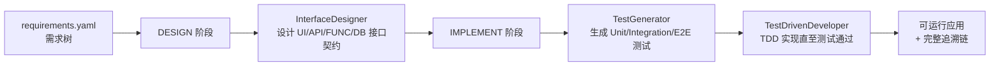

# arc-agent

> OAIC「智能体软件工厂」国际黑客松（[Factory26](https://create.gosim.org/factory26/)）参赛作品
>
> 本项目以 **ARC（Agentic Requirement Compiler，智能体需求编译器）** 为基座构建，目前处于起步阶段，在 ARC 之上进行的定制化修改还不多，后续将围绕比赛的三项评测指标（GUI 测试用例通过率、Token 效率、完成时间）持续迭代。

## 项目简介

ARC 将一份结构化的**需求树**（`requirements.yaml`）"编译"为一个可运行的应用：逐节点完成接口设计、测试生成与 TDD 实现，全程留下可追溯的工件（接口契约、测试清单、节点状态、Git 提交、runner 事件流）。

编译流程按需求树自顶向下推进，每个节点经历两个阶段：



核心设计要点（继承自 ARC 基座）：

- **需求树驱动**：非叶节点只做 UI 壳层设计，叶节点拥有完整的 UI → API → FUNC → DB 接口链。
- **测试先行**：先生成测试清单，再由 TDD 智能体实现代码，测试预算耗尽即停，避免无效 Token 消耗。
- **技能系统**（`skills/`）：按节点特征（叶/非叶、是否涉及认证会话、是否有失败历史）动态激活小规模技能集，控制上下文体积。
- **可追溯性**（`arcbench_agent_runtime/`）：requirements / scenarios / interfaces / tests / call_edges / node_states / node_contracts 七张表落盘于 `.arc/traceability/`，事件流写入 `.arc/runner-events.jsonl`，满足比赛"可复现、可审计"的要求。
- **断点续跑**：编译队列持久化于 `.arc/processing_queue.json`，支持 `--resume`、`--retry-failed`、`--retry <NODE_ID>`。

## 当前进度（相对 ARC 基座的修改）

项目刚起步，目前已完成的增量工作：

1. **成功测试套件**（`tests/`）：锁定 ARC-Bench 平台依赖的公共契约，包括
   - `arcbench_agent_runtime` SDK 单测（事件流、追溯表、Git 操作、端到端流程）；
   - Web 模板契约测试（`template.yaml` 清单与文件系统一致、Express `/api/health`、Vite 构建）；
   - 编译工作流纯函数测试。
2. **Auto TDD re-prompt**（`core/tdd_retry.py`）：运行结束后扫描 runner 事件中的 `test/failed` 节点，自动构造 TDD 优先的修复提示，为失败节点的重试提供上下文。

## 目录结构

```
arc-agent/
├── arc_main.py               # CLI 入口（compile / doctor / config 子命令）
├── main.py                   # ARC-Bench 平台适配入口
├── agents/                   # 三个舞台智能体
│   ├── interface_designer.py #   接口设计
│   ├── test_generator.py     #   测试生成
│   ├── test_driven_developer.py # TDD 实现
│   ├── context/              #   上下文流水线与提示词
│   ├── model/                #   OpenAI 兼容模型适配
│   ├── runtime/              #   deepagents 运行时封装
│   ├── skills/               #   技能选择逻辑
│   └── tools/                #   智能体工具（构建、追溯）
├── app_type_handler/         # 应用类型处理器（web / android / cli）
├── arcbench_agent_runtime/   # ARC-Bench Python SDK（事件、追溯、Git）
├── core/                     # 编译工作流、阶段调度、配置、日志
├── skills/                   # 技能库（Markdown 形式的阶段指导）
├── arc-template/templates/   # Web 应用模板（React + Vite + Express + SQLite）
└── tests/                    # 契约测试套件（见 tests/README.md）
```

## 快速开始

### 环境要求

- Python 3.11+
- Node.js + npm（`app-type=web` 时必需）
- Git

### 安装

```bash
python -m pip install -r requirements.txt
# 或
make install
```

### 配置

在项目根目录创建 `.env`（也可通过 `ARC_ENV_FILE` 指定其他路径）：

```ini
OPENAI_API_KEY=...          # 模型推理 API Key（别名 OPENAI_KEY）
OPENAI_BASE_URL=...         # API 基地址（别名 OPENAI_BASE_URL -> OPENAI_API_BASE）
MODEL=openai:gpt-5.4        # 主编码模型
ARC_OPENAI_API_MODE=chat_completions   # responses 或 chat_completions

# 可选
VISUAL_API_KEY=...          # 视觉模型（分析需求截图）
VISUAL_MODEL=...
ARC_VISUAL_ANALYSIS_CONCURRENCY=4  # 需求截图并发分析上限（1-8，默认 4）
ARC_DEBUG=1                 # 调试日志
ARC_SKIP_BROWSER_INSTALL=1  # 跳过编译前检查的 Playwright 浏览器安装（无外网环境）

# 可选：运行时行为调节
ARC_AGENT_RECURSION_LIMIT=300          # 单个阶段 agent 会话的最大步数（LangGraph recursion limit），最小 20
ARC_VISUAL_PRECOMPUTE=1                # 编译前并发预分析需求参考图（设 0/false/no/off 关闭）
ARC_VISUAL_PRECOMPUTE_CONCURRENCY=4    # 参考图预分析的并发调用数
```

运行健康检查验证配置：

```bash
python arc_main.py doctor
```

### 编译

```bash
# 将需求目录（含 requirements.yaml）编译为 Web 应用
python arc_main.py compile path/to/requirements -o path/to/output -t web --port 3301

# 清空输出目录后重新编译
python arc_main.py compile path/to/requirements -o out --clean

# 从上次中断处续跑
python arc_main.py compile path/to/requirements -o out --resume

# 重试所有失败节点 / 指定节点
python arc_main.py compile path/to/requirements -o out --resume --retry-failed
python arc_main.py compile path/to/requirements -o out --resume --retry R1.2 R1.3
```

ARC-Bench 平台入口为 `main.py`，会自动附加 `compile` 子命令并读取 `ARCBENCH_TASK_TYPE` 环境变量。

### 测试

```bash
make test        # 快速套件（无需 Node.js）
make test-slow   # 完整套件（需要 Node.js + npm，含模板集成测试）
```

## 路线图

- [ ] 针对初赛赛题（GitHub + Spreadsheets 功能复刻：Actions、组织权限、审计、Rulesets）调优技能与提示词
- [ ] Token 效率优化：上下文裁剪、缓存复用、模型分级调用
- [ ] 失败节点自动修复闭环（基于 auto TDD re-prompt 扩展）
- [ ] 更多应用类型模板支持

## 相关链接

- 比赛官网：[create.gosim.org/factory26](https://create.gosim.org/factory26/)
- 评测平台：[arc-bench.com](http://arc-bench.com/)
- 测试套件说明：[tests/README.md](tests/README.md)
- Web 模板说明：[arc-template/templates/web-react-express/README.md](arc-template/templates/web-react-express/README.md)
