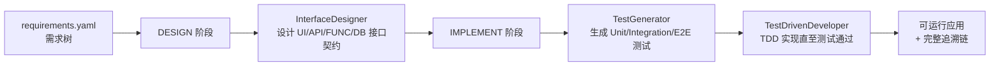

# arc-agent

> OAIC「智能体软件工厂」国际黑客松（[Factory26](https://create.gosim.org/factory26/)）参赛作品
>
> 本项目以 **ARC（Agentic Requirement Compiler，智能体需求编译器）** 为基座构建，目前处于起步阶段，在 ARC 之上进行的定制化修改还不多，后续将围绕比赛的三项评测指标（GUI 测试用例通过率、Token 效率、完成时间）持续迭代。

## 项目简介

ARC 将一份结构化的**需求树**（`requirements.yaml`）"编译"为一个可运行的应用：逐节点完成接口设计、测试生成与 TDD 实现，全程留下可追溯的工件（接口契约、测试清单、节点状态、Git 提交、runner 事件流）。

编译流程按需求树自顶向下推进，每个节点经历两个阶段：



核心设计要点（继承自 ARC 基座）：

- **需求树驱动**：非叶节点只做 UI 壳层设计，叶节点拥有完整的 UI → API → FUNC → DB 接口链。
- **测试先行**：先生成测试清单，再由 TDD 智能体实现代码，测试预算耗尽即停，避免无效 Token 消耗。
- **技能系统**（`skills/`）：按节点特征（叶/非叶、是否涉及认证会话、是否有失败历史）动态激活小规模技能集，控制上下文体积。
- **可追溯性**（`arcbench_agent_runtime/`）：requirements / scenarios / interfaces / tests / call_edges / node_states / node_contracts 七张表落盘于 `.arc/traceability/`，事件流写入 `.arc/runner-events.jsonl`，满足比赛"可复现、可审计"的要求。
- **断点续跑**：编译队列持久化于 `.arc/processing_queue.json`，支持 `--resume`、`--retry-failed`、`--retry <NODE_ID>`。

## 当前进度（相对 ARC 基座的修改）

项目刚起步，目前已完成的增量工作：

1. **成功测试套件**（`tests/`）：锁定 ARC-Bench 平台依赖的公共契约，包括
   - `arcbench_agent_runtime` SDK 单测（事件流、追溯表、Git 操作、端到端流程）；
   - Web 模板契约测试（`template.yaml` 清单与文件系统一致、Express `/api/health`、Vite 构建）；
   - 编译工作流纯函数测试。
2. **Auto TDD re-prompt**（`core/tdd_retry.py`）：运行结束后扫描 runner 事件中的 `test/failed` 节点，自动构造 TDD 优先的修复提示，为失败节点的重试提供上下文。
3. **A/B 评测**（`core/evals.py` + `arc eval` 子命令）：将 baseline 与 candidate 两个编译配置对同一需求树各运行 N 次，产出 pass rate / tokens / cache hit rate / latency / est. cost 五指标提升报告（对齐 ARC-Bench 参考实现 pi 的 `evalHarnessTable` 工作流），详见下文「A/B 评测」。

## 目录结构

```
arc-agent/
├── arc_main.py               # CLI 入口（compile / doctor / config / usage / eval 子命令）
├── main.py                   # ARC-Bench 平台适配入口
├── agents/                   # 三个舞台智能体
│   ├── interface_designer.py #   接口设计
│   ├── test_generator.py     #   测试生成
│   ├── test_driven_developer.py # TDD 实现
│   ├── context/              #   上下文流水线与提示词
│   ├── model/                #   OpenAI 兼容模型适配
│   ├── runtime/              #   deepagents 运行时封装
│   ├── skills/               #   技能选择逻辑
│   └── tools/                #   智能体工具（构建、追溯）
├── app_type_handler/         # 应用类型处理器（web / android / cli）
├── arcbench_agent_runtime/   # ARC-Bench Python SDK（事件、追溯、Git）
├── core/                     # 编译工作流、阶段调度、配置、日志、A/B 评测
├── skills/                   # 技能库（Markdown 形式的阶段指导）
├── arc-template/templates/   # Web 应用模板（React + Vite + Express + SQLite）
└── tests/                    # 契约测试套件（见 tests/README.md）
```

## 快速开始

### 环境要求

- Python 3.11+
- Node.js + npm（`app-type=web` 时必需）
- Git

### 安装

```bash
python -m pip install -r requirements.txt
# 或
make install
```

### 配置

在项目根目录创建 `.env`（也可通过 `ARC_ENV_FILE` 指定其他路径）：

```ini
OPENAI_API_KEY=...          # 模型推理 API Key（别名 OPENAI_KEY）
OPENAI_BASE_URL=...         # API 基地址（别名 OPENAI_BASE_URL -> OPENAI_API_BASE）
MODEL=openai:gpt-5.4        # 主编码模型
ARC_OPENAI_API_MODE=chat_completions   # responses 或 chat_completions

# 可选
VISUAL_API_KEY=...          # 视觉模型（分析需求截图）
VISUAL_MODEL=...
ARC_VISUAL_ANALYSIS_CONCURRENCY=4  # 需求截图并发分析上限（1-8，默认 4）
ARC_DEBUG=1                 # 调试日志
ARC_SKIP_BROWSER_INSTALL=1  # 跳过编译前检查的 Playwright 浏览器安装（无外网环境）

# 可选：运行时行为调节
ARC_AGENT_RECURSION_LIMIT=300          # 单个阶段 agent 会话的最大步数（LangGraph recursion limit），最小 20
ARC_VISUAL_PRECOMPUTE=1                # 编译前并发预分析需求参考图（设 0/false/no/off 关闭）
ARC_VISUAL_PRECOMPUTE_CONCURRENCY=4    # 参考图预分析的并发调用数

# 可选：每节点 worktree 并行（默认关闭，保持严格串行）
# 开启后每个运行中的任务在自己的 git worktree、独立 web 端口和独立 E2E 数据库中执行，
# 阶段完成后分支合并回主工作区。任务按顶层子树亲和调度：同一子树的任务在共享的
# worktree 目录中顺序执行（兄弟节点不再竞争同一批骨架文件），不同子树并行，空闲
# 槽位会从其他子树窃取任务。跨子树的共享 glue 文件冲突（如 app.js 路由注册）在
# 双方均为纯追加时由合并层机械消解，并在合并提交前通过后端健康检查；其余冲突将
# 该节点标记为失败并保留其 worktree 供排查。
ARC_NODE_WORKTREES=1                   # 启用每节点隔离 worktree（设 0/false/no/off 关闭）
ARC_MAX_CONCURRENT_TASKS=3             # 同时运行的任务数（仅在 ARC_NODE_WORKTREES=1 时生效，上限 8）
```

运行健康检查验证配置：

```bash
python arc_main.py doctor
```

### 编译

```bash
# 将需求目录（含 requirements.yaml）编译为 Web 应用
python arc_main.py compile path/to/requirements -o path/to/output -t web --port 3301

# 清空输出目录后重新编译
python arc_main.py compile path/to/requirements -o out --clean

# 从上次中断处续跑
python arc_main.py compile path/to/requirements -o out --resume

# 重试所有失败节点 / 指定节点
python arc_main.py compile path/to/requirements -o out --resume --retry-failed
python arc_main.py compile path/to/requirements -o out --resume --retry R1.2 R1.3
```

ARC-Bench 平台入口为 `main.py`，会自动附加 `compile` 子命令并读取 `ARCBENCH_TASK_TYPE` 环境变量。

### Token 用量统计

每次模型调用的 token 用量与成本会在编译过程中写入 `.arc/runner-events.jsonl`（`llm_usage`
事件，pi 风格语义：`input` 不含缓存读写，`reasoning` 是 `output` 的子集；provider 未返回
usage 时以 tiktoken 估算并标记 `source: estimated`）。编译结束后可聚合查看每节点 / 每阶段 /
每模型的用量与成本，以及 provider 前缀缓存命中率：

```bash
python arc_main.py usage --project-dir path/to/output          # 汇总报表
python arc_main.py usage --project-dir path/to/output --json   # 机读 JSON
```

命中率口径：`cache_hit_rate = cache_read / prompt_tokens`，其中 `prompt_tokens` 是
provider 已报告 usage 的调用的 prompt 总量（`input + cache_read + cache_write`）；
estimated 调用没有缓存分解，不计入分母，避免稀释命中率。provider 已报告但 cache 字段为
0 的调用视为真实未命中（不支持缓存的 provider 与从不命中的 provider 在数据上不可区分）；
没有任何已报告调用的 bucket 命中率为 `null`（报表中显示 `-`，未测量），与真实 0% 区分。
按阶段（DESIGN / IMPLEMENT /
TEST 等）的命中率视图用于定位前缀抖动：命中率低且 cache write 高，说明上下文前缀在
漂移（时间戳、随机 ID、顺序变化），先修前缀稳定性——稳定内容在前、逐节点动态内容在后——
这比压缩上下文更省成本。注意该指标度量的是 provider 的 prompt cache；`NodeContextCache`
（`agents/context/pipeline.py`）只是进程内 memoize，省的是本地计算，与此指标无关。

内置单价取自基准评测模型目录（DeepSeek / Z.AI / Moonshot / MiniMax / Qwen，CNY 每百万
token，2026-09，见 `agents/model/costing.py`）。目录是封闭集合：模型名匹配不区分大小写
（`MiniMax-M3` 与 `minimax-m3` 同价），表外模型一律不计成本（报表中显示为 unpriced），
目录调整时直接更新 `costing.py` 中的 `_BUILTIN_MODEL_COSTS` 表。

### A/B 评测

`arc eval` 将同一份需求树分别以 baseline 和 candidate 两个配置各编译 N 次，输出五指标的
candidate − baseline 提升报告（移植自 ARC-Bench 参考实现 pi 的 `evalHarnessTable`
评测工作流）。两个 arm 的差异通过环境变量覆盖和附加 compile 参数表达：

```bash
python arc_main.py eval path/to/requirements \
  --baseline-env ARC_AUTO_TDD_RETRY=0 \
  --candidate-env ARC_AUTO_TDD_RETRY=1 \
  --repetitions 5
```

- `--baseline-env` / `--candidate-env` 为各 arm 的环境变量覆盖（会盖过 `.env` 同名变量），
  `--baseline-arg` / `--candidate-arg` 为附加 compile 参数（追加在命令末尾，取值以 `=`
  形式传入时可含 `--` 前缀）。每次运行都是干净子进程：runner 前缀之后由评测器统一追加
  `<requirement> -o <workspace> -t <type> --port <port> <arm 参数>`，缺省 runner 是仓库
  `arc_main.py` 的 `compile` 子命令；`--runner-script` 可换成任意脚本（接收上述纯运行
  参数，不带 `compile` 子命令）。
- 调试用 `--repetitions 1`，报告提升时建议 5 次；`--timeout` 给单次运行设置秒级上限，
  超时按失败运行计入报告。报告默认写入 `records/evals/<时间戳>-<名称>/`，`--out-dir` 可覆盖。

```text
Eval Comparisons
  baseline vs candidate
     Baseline  baseline
    Candidate  candidate (5/5 pairs)
    Pass rate  +60.0 pp (candidate 80.0%, baseline 20.0%)
       Tokens  -1200.0 (candidate 22800.0, baseline 24000.0)
    Cache hit  +12.3 pp (candidate 61.5%, baseline 49.2%)
      Latency  -850.0ms (candidate 14000.0ms, baseline 14850.0ms)
    Est. cost  -¥0.0100 (candidate ¥0.1100, baseline ¥0.1200)
```

- 运行按 repetition 配对：pass rate 是配对运行中编译成功（runner 退出码为 0 且无 FAILED
  节点）的占比，tokens / latency / est. cost 是配对运行的均值差；cache hit rate 的口径
  与「Token 用量统计」一致（`runs.jsonl` 中存 0–1 比率，报告中以百分点呈现），运行中没有任何
  provider 已报告缓存分解的调用时记为 None。一侧缺失遥测时该指标标记 unavailable 而不是
  猜测。成本为 CNY，来自 `agents/model/costing.py` 单价目录。
- 产物目录包含 `report.txt` / `report.json`（结构化对比）、`runs.jsonl`（每次运行一条
  记录）和 `sessions/<run_id>/`（该次运行的 runner 事件、队列、追溯表、节点会话与控制台
  输出快照）。运行工作区默认放在系统临时目录并在快照后删除，`--work-root` /
  `--keep-workspaces` 可控制。

### 测试

```bash
make test        # 快速套件（无需 Node.js）
make test-slow   # 完整套件（需要 Node.js + npm，含模板集成测试）
```

## 路线图

- [ ] 针对初赛赛题（GitHub + Spreadsheets 功能复刻：Actions、组织权限、审计、Rulesets）调优技能与提示词
- [ ] Token 效率优化：上下文裁剪、缓存复用、模型分级调用
- [ ] 失败节点自动修复闭环（基于 auto TDD re-prompt 扩展）
- [ ] 更多应用类型模板支持

## 相关链接

- 比赛官网：[create.gosim.org/factory26](https://create.gosim.org/factory26/)
- 评测平台：[arc-bench.com](http://arc-bench.com/)
- 测试套件说明：[tests/README.md](tests/README.md)
- Web 模板说明：[arc-template/templates/web-react-express/README.md](arc-template/templates/web-react-express/README.md)
