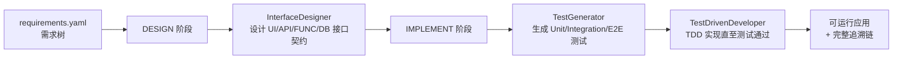

# arc-agent

> OAIC「智能体软件工厂」国际黑客松（[Factory26](https://create.gosim.org/factory26/)）参赛作品
>
> 本项目以 **ARC（Agentic Requirement Compiler，智能体需求编译器）** 为基座构建，目前处于起步阶段，在 ARC 之上进行的定制化修改还不多，后续将围绕比赛的三项评测指标（GUI 测试用例通过率、Token 效率、完成时间）持续迭代。

## 项目简介

ARC 将一份结构化的**需求树**（`requirements.yaml`）"编译"为一个可运行的应用：逐节点完成接口设计、测试生成与 TDD 实现，全程留下可追溯的工件（接口契约、测试清单、节点状态、Git 提交、runner 事件流）。

编译流程按需求树自顶向下推进，每个节点经历两个阶段：



核心设计要点（继承自 ARC 基座）：

- **需求树驱动**：非叶节点只做 UI 壳层设计，叶节点拥有完整的 UI → API → FUNC → DB 接口链。
- **DESIGN 空接口骨架修复**：flash 级模型常见"文件已写完、大型结构化 interfaces 数组交白卷"（schema 合法但为空）。修复轮从物化文件机械推导契约骨架（routes→API、services/repositories→FUNC、CREATE TABLE→DB、pages/组件→UI；已注册契约的共享面 edit 标记为 update），把大型自由输出降格为逐行填空（responsibility/specification ≤200 字符），单轮失败后分批（每批 3-4 行）重试一轮，仍缺失的行用可溯源的保守机械记录兜底（带 `skeleton_derived` 标记，不发明文件/表名）；端点支持 strict json_schema 时修复轮 schema 携带 minItems 下界使白卷成为约束违规。无物化文件的空响应只允许非叶节点走历史 warning 放行路径；叶节点返回空 `interfaces` 且无落盘文件时，先做一次复用回填询问——以追溯库已存的父/依赖接口为锚点（真实契约，不发明新 id），要求按原 `interface_id` 逐条结构化返回（`relation: reused`），并允许补列设计中新拥有的契约；回填仍为空或注册表无锚点可依时 DESIGN 直接失败（summary 散文复用不算挂接契约），避免矛盾推迟到 TestGenerator 的 owned 覆盖门禁才在整树等待后爆出。
- **测试先行 + manifest 锁定 + 基线 RED 验证**：先声明并锁定测试清单，再生成测试文件，最后由 TDD 智能体实现代码。TestGenerator 在写第一个测试文件前必须调用 `declare_test_manifest` 声明完整清单（路径 + 类型 + `coverage_scope` + 覆盖接口）：`coverage_scope=owned` 表示当前节点新增行为，`dependency` 表示依赖回归，`shared` 表示共享契约。声明时即用 app-type 放置规则和追溯库接口 id 做早期校验，锁定后测试文件的写入/编辑/删除只落在已声明路径上（`StageDisciplineMiddleware` 写入端门禁）。收尾对账：返回 manifest 中出现未声明路径的条目判为契约违规；已声明已写入但被答案漏掉的行由声明机械补回；声明了但未写入的条目剔除并告警。基线验证要求当前节点至少保留一个 `owned` 测试作为 RED witness；依赖回归和共享契约测试允许预先绿色，但会作为 exempt coverage 记录，不能替代当前节点行为证据。绿色的 owned 文件最多打回 TestGenerator 2 轮，要求删除重复覆盖或改写为对骨架必然失败的测试；修复轮的 manifest 锁用上一轮清单预置，不能通过改名逃逸。节点 git 历史已含自身 implement 检查点的重试场景除外（行为已落地，绿灯合法）。DESIGN 基线的逐文件状态写入 node session，IMPLEMENT 阶段每层首个 agent session 之前复用该状态播种（不重复跑）：全绿层由系统直接整层回归关闭，环境失败提前注入修复契约，红灯文件作为系统验证过的 RED 证据交给首个 session。TDD 循环以测试文件为微循环原子（逐文件 red→green，整层回归收口），同一失败指纹连续重复 3 次即触发假设轮换治理，测试预算耗尽即停。
- **技能系统**（`skills/`）：通用化渐进披露——每个 stage agent 的系统提示词注入全量技能目录（name + description + 路径，跨节点字节稳定、命中前缀缓存），由各 stage agent 按任务描述自行 `read_file` 匹配的 `SKILL.md`；认证一致性与失败修复两类安全底线仍确定性注入。没有独立的按节点技能规划 agent，每节点零额外 LLM 调用。
- **可追溯性**（`arcbench_agent_runtime/`）：requirements / scenarios / interfaces / tests / call_edges / node_states / node_contracts 七张表落盘于 `.arc/traceability/`，事件流写入 `.arc/runner-events.jsonl`，满足比赛"可复现、可审计"的要求。
- **断点续跑**：编译队列持久化于 `.arc/processing_queue.json`，支持 `--resume`、`--retry-failed`、`--retry <NODE_ID>`。

## 当前进度（相对 ARC 基座的修改）

项目刚起步，目前已完成的增量工作：

1. **成功测试套件**（`tests/`）：锁定 ARC-Bench 平台依赖的公共契约，包括
   - `arcbench_agent_runtime` SDK 单测（事件流、追溯表、Git 操作、端到端流程）；
   - Web 模板契约测试（`template.yaml` 清单与文件系统一致、Express `/api/health`、Vite 构建）；
   - 编译工作流纯函数测试。
2. **Auto TDD re-prompt**（`core/tdd_retry.py`）：运行结束后扫描 runner 事件中的 `test/failed` 节点，自动构造 TDD 优先的修复提示，为失败节点的重试提供上下文。
3. **A/B 评测**（`core/evals.py` + `arc eval` 子命令）：将 baseline 与 candidate 两个编译配置对同一需求树各运行 N 次，产出 pass rate / tokens / cache hit rate / latency / est. cost 五指标提升报告（对齐 ARC-Bench 参考实现 pi 的 `evalHarnessTable` 工作流），详见下文「A/B 评测」。
4. **通用化技能选择**（`agents/skills/selection.py`）：技能目录全量注入各 stage agent 系统提示词、按需读取（渐进式披露），取代早期"每节点 DESIGN 前一次规划 LLM 调用"的 SkillPlanner；认证/失败修复安全底线保留为确定性必读，各阶段实际读取的技能不再预先规划。

## 目录结构

```
arc-agent/
├── arc_main.py               # CLI 入口（compile / doctor / config / usage / eval 子命令）
├── main.py                   # ARC-Bench 平台适配入口
├── agents/                   # 三个舞台智能体
│   ├── interface_designer.py #   接口设计
│   ├── test_generator.py     #   测试生成
│   ├── test_driven_developer.py # TDD 实现
│   ├── context/              #   上下文流水线与提示词
│   ├── model/                #   OpenAI 兼容模型适配
│   ├── runtime/              #   deepagents 运行时封装
│   ├── skills/               #   技能选择逻辑
│   └── tools/                #   智能体工具（构建、追溯）
├── app_type_handler/         # 应用类型处理器（web / android / cli）
├── arcbench_agent_runtime/   # ARC-Bench Python SDK（事件、追溯、Git）
├── core/                     # 编译工作流、阶段调度、配置、日志、A/B 评测
├── skills/                   # 技能库（Markdown 形式的阶段指导）
├── arc-template/templates/   # Web 应用模板（React + Vite + Express + SQLite）
└── tests/                    # 契约测试套件（见 tests/README.md）
```

## 快速开始

### 环境要求

- Python 3.11+
- Node.js + npm（`app-type=web` 时必需）
- Git

### 安装

```bash
python -m pip install -r requirements.txt
# 或
make install
```

### 配置

在项目根目录创建 `.env`（也可通过 `ARC_ENV_FILE` 指定其他路径）：

```ini
OPENAI_API_KEY=...          # 模型推理 API Key（别名 OPENAI_KEY）
OPENAI_BASE_URL=...         # API 基地址（别名 OPENAI_BASE_URL -> OPENAI_API_BASE）
MODEL=openai:gpt-5.4        # 主编码模型
ARC_OPENAI_API_MODE=chat_completions   # responses 或 chat_completions

# 可选
VISUAL_API_KEY=...          # 视觉模型（分析需求截图）
VISUAL_MODEL=...
ARC_VISUAL_ANALYSIS_CONCURRENCY=4  # 需求截图并发分析上限（1-8，默认 4）
ARC_DEBUG=1                 # 调试日志
ARC_SKIP_BROWSER_INSTALL=1  # 跳过编译前检查的 Playwright 浏览器安装（无外网环境）

# 可选：运行时行为调节
ARC_AGENT_RECURSION_LIMIT=300          # 单个阶段 agent 会话的最大步数（LangGraph recursion limit），最小 20
ARC_MODEL_TIMEOUT=600                  # 单次模型 API 请求超时秒数（非流式请求的 read 超时=完整生成时长；
                                       # 基准中 DESIGN 大调用实测可达 ~580s，故默认保持 SDK 的 600s）
ARC_MODEL_CONNECT_TIMEOUT=15           # TCP/TLS 连接建立超时秒数（连接被静默丢弃时快速失败，默认 15）
ARC_MODEL_MAX_RETRIES=3                # 单次调用内原始尝试之外的重试次数（默认 3）
ARC_MODEL_RETRY_DELAY=5                # 重试间隔秒数（固定短延迟，默认 5；服务端 Retry-After 优先，上限
                                       # ARC_MODEL_RETRY_MAX_DELAY=60）
ARC_MODEL_MAX_CONSECUTIVE_FAILURES=5   # 跨调用连续失败熔断阈值（默认 5）：同一端点连续 5 次模型调用失败后，
                                       # 后续调用立即失败并提示 --resume；任一成功即重置计数（设 0 关闭）
ARC_MODEL_STREAM_TRANSPORT=stream        # 模型调用的流式传输策略（默认 stream）：stream=首次尝试即流式
                                       # （SSE chunk 持续流动，可穿过网关对非流式响应的 ~120s 空闲切断；
                                       # 端点对流式请求回 4xx 时自动回退纯非流式并进程内记住该端点）；
                                       # retry=首次非流式，仅连接类失败后的重试切流式；
                                       # 0/false/no/off=完全关闭流式（恢复旧行为）
ARC_MODEL_STREAM_CHUNK_TIMEOUT=90      # 流式响应相邻 SSE chunk 的最大间隔秒数（默认 90，低于 langchain-openai
                                       # 的 120s）：流中途静默卡死（TCP 存活但零字节）在该时限内被发现并按
                                       # 连接类失败换传输方式重试，而不是等到 600s 读超时或把整个 agent
                                       # 会话回退重放；设 0 关闭该看门狗
ARC_MODEL_STREAM_USAGE=1               # 流式 chat.completions 请求是否携带 stream_options.include_usage（默认
                                       # 开）：开启后末个 SSE chunk 携带端点真实 usage（含缓存命中），llm_usage
                                       # 事件从 tiktoken 估算（cache_read 按定义为 0）转为 reported 口径；
                                       # 某网关 4xx 拒绝该选项时设 0/false/no/off 恢复旧行为（端点会整体回退
                                       # 纯非流式——非流式响应本身自带 usage，计费不受影响，只失去流式对网关
                                       # 空闲切断的防护）
ARC_VISUAL_PRECOMPUTE=1                # 编译前并发预分析需求参考图（设 0/false/no/off 关闭）
ARC_VISUAL_PRECOMPUTE_CONCURRENCY=4    # 参考图预分析的并发调用数
ARC_STRUCTURED_OUTPUT=auto             # 结构化输出（pydantic response_format）开关：auto（默认，对自定义
                                       # OPENAI_BASE_URL 端点做一次进程内缓存的工具调用能力探测）、
                                       # on（强制启用）、off（强制关闭，等价旧行为）
                                       # auto 模式下还会独立探测 chat_completions 的 response_format
                                       # json_schema（strict）支持（独立缓存、fail-open）：支持时 DESIGN
                                       # 空接口修复轮会重建 agent 并在 interfaces 数组上携带 minItems
                                       # 语义下界，把"合法交白卷"变成约束违规；不支持时静默走骨架
                                       # 填空修复路径

# 每节点 worktree 并行（默认开启）
# 每个运行中的任务在自己的 git worktree、独立 web 端口和独立 E2 数据库中执行，
# 阶段完成后分支合并回主工作区。任务按顶层子树亲和调度：同一子树的任务在共享的
# worktree 目录中顺序执行（兄弟节点不再竞争同一批骨架文件），不同子树并行，空闲
# 槽位会从其他子树窃取任务。父子之间 DESIGN 串行：子节点的 DESIGN 等到父节点
# DESIGN 完成并合并后才调度，子节点从包含父壳层（app 入口、布局、共享面）的
# integration HEAD 分支出工作区，对共享面做增量注册不再与父节点的改写冲突
# （父节点 DESIGN 失败不阻塞子节点）。需求树声明的 dependencies 参与调度：节点的
# DESIGN 和 IMPLEMENT 都等到其依赖节点的 IMPLEMENT 成功并合并进 integration HEAD
# 后才开始。依赖节点失败时，直接和传递依赖节点标记为 BLOCKED_BY_DEPENDENCY，
# 不会在未验证的接口上继续实现；无依赖的独立节点仍可继续用于诊断，但整个编译结果
# 不能因此变成成功。依赖方的设计因此从依赖节点
# 真实落地的接口出发做增量复用（如登录节点直接复用注册节点的 auth 路由与会话
# 头），不再并行重复设计同一套共享面；依赖节点的场景也常依赖其创建的运行期数据
# （如登录节点的演示账号由注册节点创建），提前实现会把缺失前置状态变成假失败；
# 依赖成环（含仅通过父子调度规则闭合的环，如叔侄交叉依赖）、祖先与
# 自己的后代之间的边（父子规则本就保证其顺序），或恢复的队列里引用了本队列无法
# 调度的节点（手改/外来队列文件）时，对应边丢弃并告警，避免队列停摆。亲和权重按
# "本组剩余任务 + 等待它的各组剩余任务"计算，避免被全树依赖的小枢纽子树排在大型
# 独立子树之后长期饿死。
# 跨子树的共享 glue 文件冲突（如 app.js 路由
# 注册）在双方均为纯追加时由合并层机械消解，并在合并提交前通过后端健康检查；其余
# 冲突将该节点标记为失败并保留其 worktree 供排查。
# 两个补充防线：新文件的跨节点占用注册（写时声明，agent 试图创建兄弟节点已占用的
# 新文件时直接拒绝并给出改道指引，状态存于 .arc/file_claims.json）；DESIGN 与
# IMPLEMENT 阶段的
# 合并冲突不再立即失败——首次冲突将节点重排队一次（DESIGN 重排 DESIGN，IMPLEMENT
# 只重排 IMPLEMENT，已完成的 DESIGN 产物保留），重试从已合并的 integration
# HEAD 出发（兄弟文件已在磁盘可见），冲突路径注入 prompt 指引绕行，二次冲突才终判
# 失败。
# 设 0/false/no/off 恢复共享工作区的严格串行调度。
ARC_NODE_WORKTREES=1                   # 每节点隔离 worktree 并行（默认开启；设 0/false/no/off 关闭）
ARC_MAX_CONCURRENT_TASKS=3             # 同时运行的任务数（仅并行模式生效，默认 3，上限 8）
ARC_AFFINITY_DEPTH=1                   # 亲和分组切分深度（默认 1=顶层子树一组；设 2 让宽子树的
                                       # 特性子树各自成组并行，如 simple-keep 的 REQ-2；组内仍串行）
```

运行健康检查验证配置：

```bash
python arc_main.py doctor
```

### 编译

```bash
# 将需求目录（含 requirements.yaml）编译为 Web 应用
python arc_main.py compile path/to/requirements -o path/to/output -t web --port 3301

# 清空输出目录后重新编译
python arc_main.py compile path/to/requirements -o out --clean

# 从上次中断处续跑
python arc_main.py compile path/to/requirements -o out --resume

# 重试所有失败节点 / 指定节点
python arc_main.py compile path/to/requirements -o out --resume --retry-failed
python arc_main.py compile path/to/requirements -o out --resume --retry R1.2 R1.3
```

ARC-Bench 平台入口为 `main.py`，会自动附加 `compile` 子命令并读取 `ARCBENCH_TASK_TYPE` 环境变量。

### Token 用量统计

每次模型调用的 token 用量与成本会在编译过程中写入 `.arc/runner-events.jsonl`（`llm_usage`
事件，pi 风格语义：`input` 不含缓存读写，`reasoning` 是 `output` 的子集；provider 未返回
usage 时以 tiktoken 估算并标记 `source: estimated`）。每个事件还携带可选的 `latency` 块
（`duration_s` 端到端耗时、`transport` 实际应答的传输方式 `streamed`/`plain`、`attempts`
适配器重试循环消耗的尝试次数；旧版本事件无该块，读取方需按可选处理）。编译结束后可聚合
查看每节点 / 每阶段 / 每模型的用量、成本、调用延迟与传输分布，以及 provider 前缀缓存命中率：

```bash
python arc_main.py usage --project-dir path/to/output          # 汇总报表
python arc_main.py usage --project-dir path/to/output --json   # 机读 JSON
```

命中率口径：`cache_hit_rate = cache_read / prompt_tokens`，其中 `prompt_tokens` 是
provider 已报告 usage 的调用的 prompt 总量（`input + cache_read + cache_write`）；
estimated 调用没有缓存分解，不计入分母，避免稀释命中率。provider 已报告但 cache 字段为
0 的调用视为真实未命中（不支持缓存的 provider 与从不命中的 provider 在数据上不可区分）；
没有任何已报告调用的 bucket 命中率为 `null`（报表中显示 `-`，未测量），与真实 0% 区分。
按阶段（DESIGN / IMPLEMENT /
TEST 等）的命中率视图用于定位前缀抖动：命中率低且 cache write 高，说明上下文前缀在
漂移（时间戳、随机 ID、顺序变化），先修前缀稳定性——稳定内容在前、逐节点动态内容在后——
这比压缩上下文更省成本。注意该指标度量的是 provider 的 prompt cache；`NodeContextCache`
（`agents/context/pipeline.py`）只是进程内 memoize，省的是本地计算，与此指标无关。

### 工具往返观测

agent 的每次工具往返（含被 stage discipline 拦截的调用）同样写入 `runner-events.jsonl`
（`tool_usage` 事件：`tool` / `status`（`ok`、`error`、`blocked`）/ `detail`（文件路径、
`read_file` 的 `offset`/`limit`、结果字符数与是否为空））。`usage` 命令会聚合出每节点 /
每工具的往返次数，以及两个浪费信号：`unpaged_reads`（未带 `limit` 的整文件读取）和
`empty_results`（成功但返回为空，即无效 grep/读取），用于定位"全量读大文件""无效搜索"
这类可修复的往返浪费。

内置单价取自基准评测模型目录（DeepSeek / Z.AI / Moonshot / MiniMax / Qwen，CNY 每百万
token，2026-09，见 `agents/model/costing.py`）。目录是封闭集合：模型名匹配不区分大小写
（`MiniMax-M3` 与 `minimax-m3` 同价），表外模型一律不计成本（报表中显示为 unpriced），
目录调整时直接更新 `costing.py` 中的 `_BUILTIN_MODEL_COSTS` 表。

### A/B 评测

`arc eval` 将同一份需求树分别以 baseline 和 candidate 两个配置各编译 N 次，输出五指标的
candidate − baseline 提升报告（移植自 ARC-Bench 参考实现 pi 的 `evalHarnessTable`
评测工作流）。两个 arm 的差异通过环境变量覆盖和附加 compile 参数表达：

```bash
python arc_main.py eval path/to/requirements \
  --baseline-env ARC_AUTO_TDD_RETRY=0 \
  --candidate-env ARC_AUTO_TDD_RETRY=1 \
  --repetitions 5
```

- `--baseline-env` / `--candidate-env` 为各 arm 的环境变量覆盖（会盖过 `.env` 同名变量），
  `--baseline-arg` / `--candidate-arg` 为附加 compile 参数（追加在命令末尾，取值以 `=`
  形式传入时可含 `--` 前缀）。每次运行都是干净子进程：runner 前缀之后由评测器统一追加
  `<requirement> -o <workspace> -t <type> --port <port> <arm 参数>`，缺省 runner 是仓库
  `arc_main.py` 的 `compile` 子命令；`--runner-script` 可换成任意脚本（接收上述纯运行
  参数，不带 `compile` 子命令）。
- 调试用 `--repetitions 1`，报告提升时建议 5 次；`--timeout` 给单次运行设置秒级上限，
  超时按失败运行计入报告。`--arm-order alternate` 会在 repetition 之间交替先运行
  baseline/candidate，降低 provider 负载和缓存预热造成的时序偏差；默认仍保持
  baseline-first 以兼容已有脚本。报告默认写入 `records/evals/<时间戳>-<名称>/`，`--out-dir` 可覆盖。

```text
Eval Comparisons
  baseline vs candidate
     Baseline  baseline
    Candidate  candidate (5/5 pairs)
    Pass rate  +60.0 pp (candidate 80.0%, baseline 20.0%)
       Tokens  -1200.0 (candidate 22800.0, baseline 24000.0)
    Cache hit  +12.3 pp (candidate 61.5%, baseline 49.2%)
      Latency  -850.0ms (candidate 14000.0ms, baseline 14850.0ms)
    Est. cost  -¥0.0100 (candidate ¥0.1100, baseline ¥0.1200)
```

- 运行按 repetition 配对：pass rate 是配对运行中编译成功（runner 退出码为 0 且无 FAILED
  节点、queue task 全部完成且没有非终态节点）的占比，tokens / latency / est. cost 是配对运行的均值差；
  `comparison.latency_distribution` 还提供每个 arm 的 mean/median/p95/min/max 和 paired delta，避免
  长尾运行被均值掩盖；`report.txt` 的 p95 行同时标出样本数，避免把单次调试运行误读为稳定的
  百分位估计；cache hit rate 的口径
  与「Token 用量统计」一致（`runs.jsonl` 中存 0–1 比率，报告中以百分点呈现），运行中没有任何
  provider 已报告缓存分解的调用时记为 None。一侧缺失遥测时该指标标记 unavailable 而不是
  猜测。成本为 CNY，来自 `agents/model/costing.py` 单价目录。
- 产物目录包含 `report.txt` / `report.json`（结构化对比）、`runs.jsonl`（每次运行一条
 记录）和 `sessions/<run_id>/`（该次运行的 runner 事件、队列、追溯表、节点会话与控制台
 输出快照）。每条 run 还含 `diagnostics`：task 完成计数、失败事件/fingerprint、traceability
  测试状态、LLM 按节点/阶段/模型聚合、tool blocked/error/empty/unpaged 信号和明确的 outcome
  分类。`events_present` 标记 runner event 是否存在；缺失 event 不会伪造 token/cost 数据。
  工件中的 arm 环境变量会对敏感 key/token/secret/password 字段及常见 token 值脱敏。运行工作区默认放在系统临时目录并在快照后删除，
  `--work-root` /
  `--keep-workspaces` 可控制。

### 测试

```bash
make test        # 快速套件（无需 Node.js）
make test-slow   # 完整套件（需要 Node.js + npm，含模板集成测试）
```

## 路线图

- [ ] 针对初赛赛题（GitHub + Spreadsheets 功能复刻：Actions、组织权限、审计、Rulesets）调优技能与提示词
- [ ] Token 效率优化：上下文裁剪、缓存复用、模型分级调用
- [ ] 失败节点自动修复闭环（基于 auto TDD re-prompt 扩展）
- [ ] 更多应用类型模板支持

## 相关链接

- 比赛官网：[create.gosim.org/factory26](https://create.gosim.org/factory26/)
- 评测平台：[arc-bench.com](http://arc-bench.com/)
- 测试套件说明：[tests/README.md](tests/README.md)
- Web 模板说明：[arc-template/templates/web-react-express/README.md](arc-template/templates/web-react-express/README.md)
