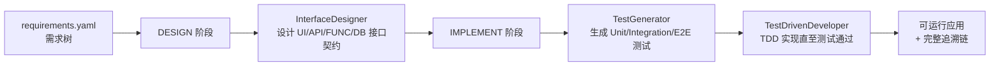

# arc-agent

> OAIC「智能体软件工厂」国际黑客松（[Factory26](https://create.gosim.org/factory26/)）参赛作品
>
> 本项目以 **ARC（Agentic Requirement Compiler，智能体需求编译器）** 为基座构建，围绕比赛的三项评测指标（GUI 测试用例通过率、Token 效率、完成时间）持续迭代。

## 项目简介

ARC 将一份结构化的**需求树**（`requirements.yaml`）"编译"为一个可运行的应用：逐节点完成接口设计、测试生成与 TDD 实现，全程留下可追溯的工件（接口契约、测试清单、节点状态、Git 提交、runner 事件流）。

编译流程按需求树自顶向下推进，每个节点经历 DESIGN / IMPLEMENT 两个阶段：



核心设计要点（继承自 ARC 基座）：

- **需求树驱动**：非叶节点只做 UI 壳层设计，叶节点拥有完整的 UI → API → FUNC → DB 接口链。
- **测试先行 + manifest 锁定**：TestGenerator 先声明并锁定测试清单再写测试文件，写入/编辑/删除只落在已声明路径上；每个节点至少保留一个 `owned` 测试作为 RED witness，由 TDD 智能体实现直至通过，防止"先写实现再配测试"的假绿。
- **DESIGN 空接口骨架修复**：flash 级模型交白卷（schema 合法但 `interfaces` 为空）时，从物化文件机械推导契约骨架做逐行填空；叶节点复用回填仍为空则 DESIGN 直接失败，避免矛盾推迟到整树等待后才爆出。
- **技能系统**（`skills/`）：技能目录全量注入各 stage agent 系统提示词、按需读取（渐进式披露），没有独立的技能规划 agent，每节点零额外 LLM 调用。
- **可追溯性**（`arcbench_agent_runtime/`）：requirements / scenarios / interfaces / tests / call_edges / node_states / node_contracts 七张表落盘于 `.arc/traceability/`，事件流写入 `.arc/runner-events.jsonl`，满足比赛"可复现、可审计"的要求。
- **断点续跑**：编译队列持久化于 `.arc/processing_queue.json`，支持 `--resume`、`--retry-failed`、`--retry <NODE_ID>`。

相对 ARC 基座的主要定制：

- **每节点 worktree 并行调度**：任务按子树亲和分组、依赖参与调度门禁、合并冲突分级消解（配置见 [`docs/configuration.md`](docs/configuration.md)）；
- **A/B 评测与用量观测**：`arc eval` 五指标对比报告、`usage` 命令聚合 token / 成本 / 缓存命中 / 工具往返（见 [`docs/evals.md`](docs/evals.md)）；
- **通用化技能选择**：目录注入 + 按需读取取代早期每节点一次规划调用的 SkillPlanner；
- **运行后 auto TDD re-prompt**（`core/tdd_retry.py`）：扫描失败节点自动构造 TDD 修复提示，为重试提供上下文。

## 目录结构

```
arc-agent/
├── arc_main.py               # CLI 入口（compile / doctor / config / usage / eval 子命令）
├── main.py                   # ARC-Bench 平台适配入口
├── agents/                   # 三个舞台智能体
│   ├── interface_designer.py #   接口设计
│   ├── test_generator.py     #   测试生成
│   ├── test_driven_developer.py # TDD 实现
│   ├── context/              #   上下文流水线与提示词
│   ├── model/                #   OpenAI 兼容模型适配
│   ├── runtime/              #   deepagents 运行时封装
│   ├── skills/               #   技能选择逻辑
│   └── tools/                #   智能体工具（构建、追溯）
├── app_type_handler/         # 应用类型处理器（web / android / cli）
├── arcbench_agent_runtime/   # ARC-Bench Python SDK（事件、追溯、Git）
├── core/                     # 编译工作流、阶段调度、配置、日志、A/B 评测
├── skills/                   # 技能库（Markdown 形式的阶段指导）
├── arc-template/templates/   # Web 应用模板（React + Vite + Express + SQLite）
├── docs/                     # 配置、评测文档与 ADR
└── tests/                    # 契约测试套件（见 tests/README.md）
```

## 快速开始

### 环境要求

- Python 3.11+
- Node.js + npm（`app-type=web` 时必需）
- Git

### 安装

```bash
python -m pip install -r requirements.txt
# 或
make install
```

### 配置

在项目根目录创建 `.env`（也可通过 `ARC_ENV_FILE` 指定其他路径）：

```ini
OPENAI_API_KEY=...                    # 模型推理 API Key（别名 OPENAI_KEY）
OPENAI_BASE_URL=...                   # API 基地址（别名 OPENAI_API_BASE）
MODEL=openai:gpt-5.4                  # 主编码模型
ARC_OPENAI_API_MODE=chat_completions  # responses 或 chat_completions
```

可选变量（视觉模型、调试、模型调用超时/重试/流式、并行调度等）见[配置参考](docs/configuration.md)。运行健康检查验证配置：

```bash
python arc_main.py doctor
```

### 编译

```bash
# 将需求目录（含 requirements.yaml）编译为 Web 应用
python arc_main.py compile path/to/requirements -o path/to/output -t web --port 3301

# 清空输出目录后重新编译
python arc_main.py compile path/to/requirements -o out --clean

# 从上次中断处续跑
python arc_main.py compile path/to/requirements -o out --resume

# 重试所有失败节点 / 指定节点
python arc_main.py compile path/to/requirements -o out --resume --retry-failed
python arc_main.py compile path/to/requirements -o out --resume --retry R1.2 R1.3
```

ARC-Bench 平台入口为 `main.py`，会自动附加 `compile` 子命令并读取 `ARCBENCH_TASK_TYPE` 环境变量。

### 测试

```bash
make test        # 快速套件（无需 Node.js）
make test-slow   # 完整套件（需要 Node.js + npm，含模板集成测试）
```

没有 `make` 的环境可直接用 `python -m pytest -p no:anyio -m "not slow"`（完整套件去掉 `-m` 过滤）。

## 评测与用量观测

编译结束后聚合查看每节点 / 每阶段 / 每模型的 token 用量、成本、调用延迟、缓存命中率与工具往返：

```bash
python arc_main.py usage --project-dir path/to/output          # 汇总报表
python arc_main.py usage --project-dir path/to/output --json   # 机读 JSON
```

A/B 评测将同一份需求树以 baseline / candidate 两个配置各编译 N 次，产出五指标提升报告：

```bash
python arc_main.py eval path/to/requirements \
  --baseline-env ARC_AUTO_TDD_RETRY=0 \
  --candidate-env ARC_AUTO_TDD_RETRY=1 \
  --repetitions 5
```

指标口径、事件语义与产物结构见[评测与用量观测文档](docs/evals.md)。

## 路线图

- [ ] 针对初赛赛题（GitHub + Spreadsheets 功能复刻：Actions、组织权限、审计、Rulesets）调优技能与提示词
- [ ] Token 效率优化：上下文裁剪、缓存复用、模型分级调用
- [ ] 失败节点自动修复闭环（基于 auto TDD re-prompt 扩展）
- [ ] 更多应用类型模板支持

## 相关链接

- 比赛官网：[create.gosim.org/factory26](https://create.gosim.org/factory26/)
- 评测平台：[arc-bench.com](http://arc-bench.com/)
- 配置参考：[docs/configuration.md](docs/configuration.md)
- 评测与用量观测：[docs/evals.md](docs/evals.md)
- 测试套件说明：[tests/README.md](tests/README.md)
- Web 模板说明：[arc-template/templates/web-react-express/README.md](arc-template/templates/web-react-express/README.md)

## License

[MIT](LICENSE)
