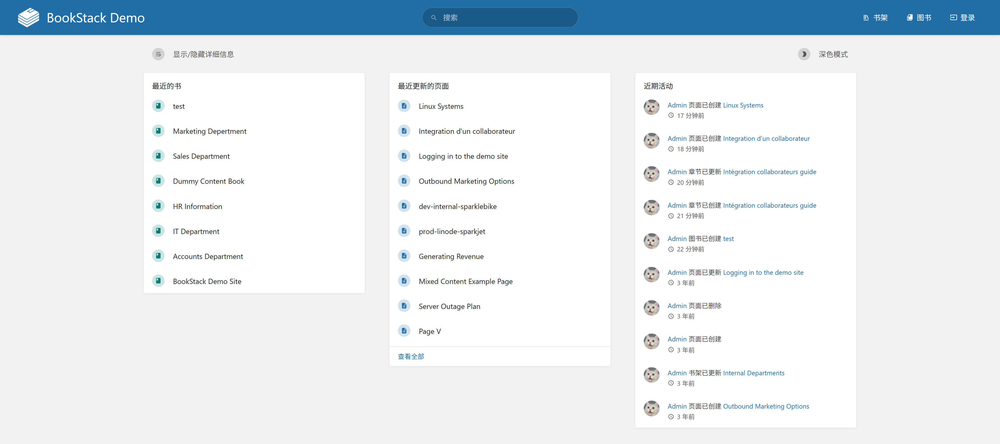
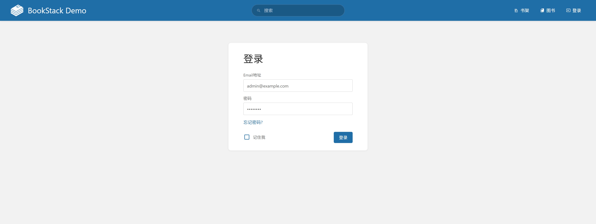
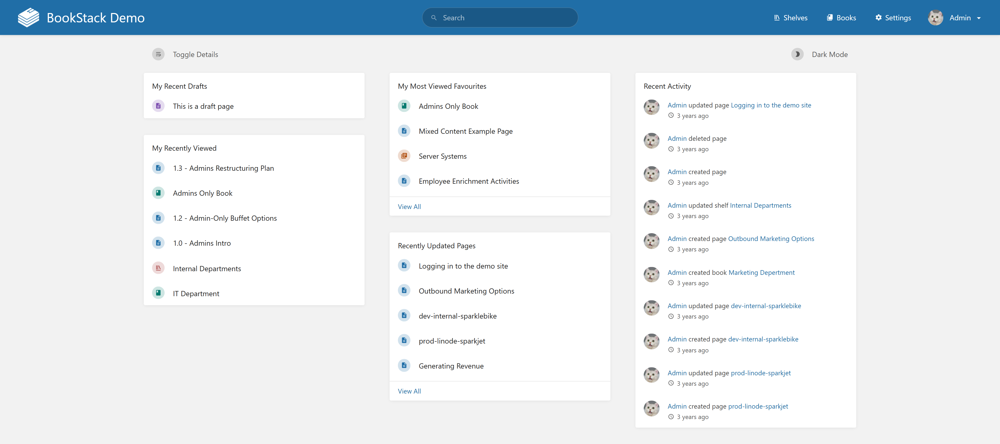
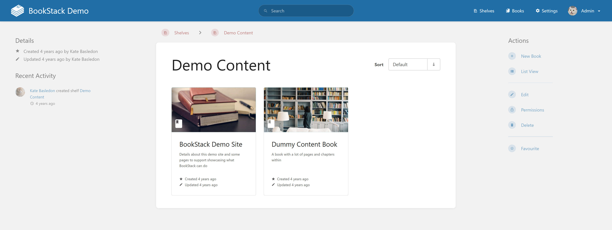
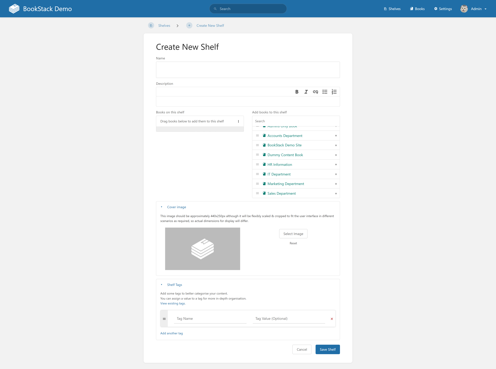
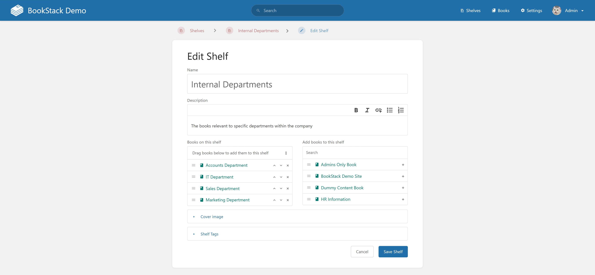
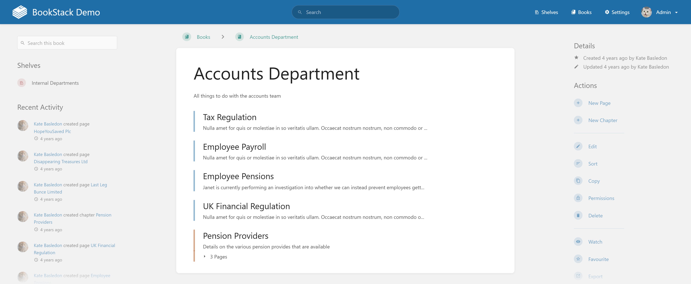
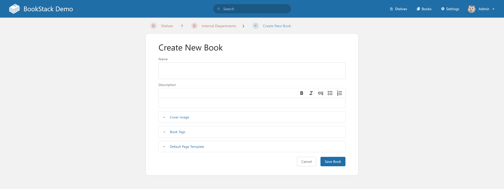
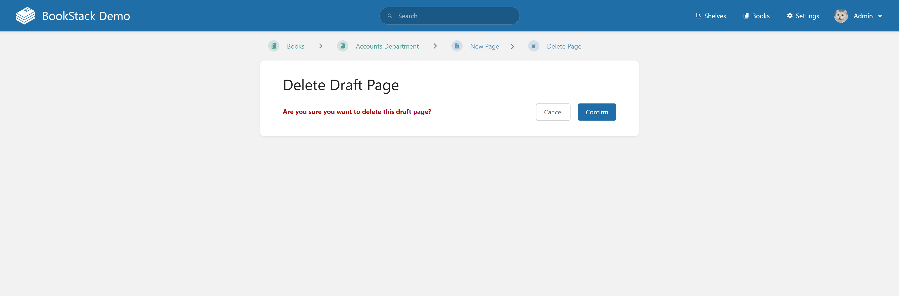

# BookStack Knowledge Base System
Web-based knowledge base system for browsing, organizing, and reading shelves, books, chapters, and pages.

## REQ-1 Homepage
Default landing page of the system. It presents the global navigation bar, search input, and visible entry points to core areas of the product. Reference image 

**Dependencies:** None

### REQ-1.1 Open Homepage
Open the application and display the homepage.

**Dependencies:** None

**Scenarios:**
- Open Homepage
  - **GIVEN:** The system is accessible.
  - **WHEN:** The user opens the application URL.
  - **THEN:** The homepage is displayed as the default page.

### REQ-1.2 Back to Homepage from Other Pages
Return to the homepage by clicking the BookStack logo in the global navigation bar.

**Dependencies:** REQ-1.1

**Scenarios:**
- Back to Homepage from Other Pages
  - **GIVEN:** The user is on a non-homepage page and the global navigation bar is visible.
  - **WHEN:** The user clicks the BookStack logo in the top-left corner.
  - **THEN:** The system navigates to the homepage.

## REQ-2 User Authentication and Session
Provides login entry and authenticated session state. The login page and the authenticated homepage state follow the referenced layouts. Login page  Homepage after login 

**Dependencies:** REQ-1

### REQ-2.1 Enter Login Page
Open the login form from the homepage navigation bar.

**Dependencies:** REQ-1.1

**Scenarios:**
- Enter Login Page
  - **GIVEN:** The user is on the homepage and is not logged in.
  - **WHEN:** The user clicks `Login` in the homepage navigation bar.
  - **THEN:** The system displays the login form page.

### REQ-2.2 Log In Successfully
Authenticate with valid credentials and enter the authenticated homepage state.

**Dependencies:** REQ-2.1

**Scenarios:**
- Log In Successfully
  - **GIVEN:** The user is on the login form page.
  - **WHEN:** The user enters a valid email and password, enables `Remember Me`, and clicks `Login`.
  - **THEN:** The system logs the user in, returns to the homepage, and displays the user nickname in the top-right area.

## REQ-3 Authenticated Homepage Dashboard
Authenticated homepage dashboard that shows recent drafts, recently viewed items, most viewed favorites, recently updated pages, recent activity, and the dashboard controls shown in the reference image. Reference image 

**Dependencies:** REQ-2

### REQ-3.1 Enter Authenticated Homepage
Display the dashboard layout after a successful login.

**Dependencies:** REQ-2.2

**Scenarios:**
- Enter Authenticated Homepage
  - **GIVEN:** The user has logged in successfully.
  - **WHEN:** The system finishes the post-login navigation.
  - **THEN:** The authenticated homepage dashboard is displayed with its overview cards and lists.

## REQ-4 Shelves Module
Shelves are top-level content containers with name, description, related books, and tags. This module covers listing shelves, opening shelf details, creating shelves, editing shelves, and deleting shelves. Shelf list page 

**Dependencies:** REQ-1

### REQ-4.1 View Shelf List
Open the shelf list page from the global navigation bar.

**Dependencies:** REQ-1.1

**Scenarios:**
- View Shelf List
  - **GIVEN:** The user is on a page where the global navigation bar is visible.
  - **WHEN:** The user clicks `Shelves` in the top navigation bar.
  - **THEN:** The system displays the shelf list page.

### REQ-4.2 Shelf Details Page
Shelf details page that shows shelf information, included books, and the related action panel. Reference image 

**Dependencies:** REQ-4.1

#### REQ-4.2.1 Enter Shelf Details Page
Open the details page of a shelf from the shelf list.

**Dependencies:** REQ-4.1

**Scenarios:**
- Enter Shelf Details Page
  - **GIVEN:** The user is on the shelf list page and at least one shelf is visible.
  - **WHEN:** The user clicks a shelf in the list.
  - **THEN:** The system displays the selected shelf details page.

### REQ-4.3 Create New Shelf
Provide a shelf creation flow with fields for shelf name, description, and tags. Reference image 

**Dependencies:** REQ-4.2

#### REQ-4.3.1 Create Shelf
Create a shelf from the shelf creation form.

**Dependencies:** REQ-4.2.1

**Scenarios:**
- Create Shelf
  - **GIVEN:** The user is on the shelf details page and can access the action panel.
  - **WHEN:** The user opens the `New Shelf` flow, enters shelf information, and clicks `Save Shelf`.
  - **THEN:** The system creates the shelf and displays it in the shelf list.

#### REQ-4.3.2 Cancel Creation
Exit the shelf creation flow without saving a new shelf.

**Dependencies:** REQ-4.2.1

**Scenarios:**
- Cancel Creation
  - **GIVEN:** The user is on the shelf creation page.
  - **WHEN:** The user clicks `Cancel`.
  - **THEN:** The system returns to the shelf list without creating a new shelf.

### REQ-4.4 Delete Shelf
Delete the current shelf from the shelf details flow with confirmation. Confirmation page 

**Dependencies:** REQ-4.2

#### REQ-4.4.1 Confirm Delete Shelf
Delete a shelf after the user confirms the action.

**Dependencies:** REQ-4.2.1

**Scenarios:**
- Confirm Delete Shelf
  - **GIVEN:** The user is on the shelf details page and can access the action panel.
  - **WHEN:** The user clicks `Delete` and confirms the deletion on the confirmation page.
  - **THEN:** The system deletes the shelf and returns to the shelf list page.

#### REQ-4.4.2 Cancel Delete Shelf
Exit the delete flow without deleting the shelf.

**Dependencies:** REQ-4.2.1

**Scenarios:**
- Cancel Delete Shelf
  - **GIVEN:** The user is on the delete shelf confirmation page.
  - **WHEN:** The user clicks `Cancel`.
  - **THEN:** The system returns to the shelf details page and keeps the shelf unchanged.

### REQ-4.5 Edit Shelf
Provide a shelf editing flow for changing shelf information, related books, and tags. Shelf edit page 

**Dependencies:** REQ-4.2

#### REQ-4.5.1 Save Shelf Edits
Save changes made in the shelf edit form.

**Dependencies:** REQ-4.2.1

**Scenarios:**
- Save Shelf Edits
  - **GIVEN:** The user is on the shelf details page and can access the action panel.
  - **WHEN:** The user clicks `Edit`, updates shelf information, and clicks `Save Shelf`.
  - **THEN:** The system saves the changes and returns to the shelf details page.

#### REQ-4.5.2 Cancel Shelf Edits
Exit the shelf editing flow without saving changes.

**Dependencies:** REQ-4.2.1

**Scenarios:**
- Cancel Shelf Edits
  - **GIVEN:** The user is on the shelf edit page.
  - **WHEN:** The user clicks `Cancel`.
  - **THEN:** The system returns to the shelf details page without applying the edits.

## REQ-5 Books Module
Books contain a name, description, chapters, and pages. This module covers viewing books, opening book details, creating books, editing books, deleting books, and creating books from a shelf context. Book list page 

**Dependencies:** REQ-1

### REQ-5.1 View Books List
Open the books list page from the global navigation bar.

**Dependencies:** REQ-1.1

**Scenarios:**
- View Books List
  - **GIVEN:** The user is on a page where the global navigation bar is visible.
  - **WHEN:** The user clicks `Books` in the top navigation bar.
  - **THEN:** The system displays the books list page with book cards and the action panel.

### REQ-5.2 Book Details Page
Book details page that can be opened from supported book entry points and displays the selected book information. Book details page 

**Dependencies:** REQ-5.1

#### REQ-5.2.1 Enter Book Details Page through Book List Page
Open a book details page from the books list.

**Dependencies:** REQ-5.1

**Scenarios:**
- Enter Book Details Page through Book List Page
  - **GIVEN:** The user is on the books list page and at least one book card is visible.
  - **WHEN:** The user clicks a book card in the list.
  - **THEN:** The system displays the selected book details page.

#### REQ-5.2.2 Enter Book Details Page through Shelf Details Page
Open a book details page from a shelf details page.

**Dependencies:** REQ-4.2.1

**Scenarios:**
- Enter Book Details Page through Shelf Details Page
  - **GIVEN:** The user is on a shelf details page and at least one book is listed on the shelf.
  - **WHEN:** The user clicks a book in the shelf details page.
  - **THEN:** The system displays the selected book details page.

### REQ-5.3 Create Book in Book List Page
Provide a book creation flow from the books list page with fields for name, rich-text description, optional cover image, book tags, and default page template. Reference image 

**Dependencies:** REQ-5.1

#### REQ-5.3.1 Fill out and Save Book
Create a new book from the books list page.

**Dependencies:** REQ-5.1

**Scenarios:**
- Fill out and Save Book
  - **GIVEN:** The user is on the books list page and can access the action panel.
  - **WHEN:** The user clicks `Create New Book`, enters the required information, and clicks `Save Book`.
  - **THEN:** The system creates the book and opens the created book details page.

#### REQ-5.3.2 Cancel Creating Book
Exit the book creation flow without creating a book.

**Dependencies:** REQ-5.1

**Scenarios:**
- Cancel Creating Book
  - **GIVEN:** The user is on the create new book page.
  - **WHEN:** The user clicks `Cancel`.
  - **THEN:** The system returns to the previous page and does not create a new book.

### REQ-5.4 Edit Book
Provide a book editing flow for changing book metadata on the book details page. Reference image 

**Dependencies:** REQ-5.2

#### REQ-5.4.1 Save Book Edits
Save changes made in the book edit form.

**Dependencies:** REQ-5.2.1

**Scenarios:**
- Save Book Edits
  - **GIVEN:** The user is on the book details page and can access the action panel.
  - **WHEN:** The user clicks `Edit`, updates book information, and clicks `Save Book`.
  - **THEN:** The system saves the changes and returns to the book details page.

#### REQ-5.4.2 Cancel Book Edits
Exit the book editing flow without saving changes.

**Dependencies:** REQ-5.2.1

**Scenarios:**
- Cancel Book Edits
  - **GIVEN:** The user is on the book edit page.
  - **WHEN:** The user clicks `Cancel`.
  - **THEN:** The system returns to the book details page without applying the edits.

### REQ-5.5 Delete Book
Delete the current book from the book details flow with confirmation. Confirmation page 

**Dependencies:** REQ-5.2

#### REQ-5.5.1 Confirm Delete Book
Delete a book after the user confirms the action.

**Dependencies:** REQ-5.2.1

**Scenarios:**
- Confirm Delete Book
  - **GIVEN:** The user is on the book details page and can access the action panel.
  - **WHEN:** The user clicks `Delete` and confirms the deletion.
  - **THEN:** The system deletes the book and returns to the books list page.

#### REQ-5.5.2 Cancel Delete Book
Exit the delete flow without deleting the book.

**Dependencies:** REQ-5.2.1

**Scenarios:**
- Cancel Delete Book
  - **GIVEN:** The user is on the delete book confirmation page.
  - **WHEN:** The user clicks `Cancel`.
  - **THEN:** The system returns to the book details page and keeps the book unchanged.

### REQ-5.6 Create Book from Shelf Details Page
Provide a book creation flow from a shelf details page so the created book is associated with the current shelf.

**Dependencies:** REQ-4.2

#### REQ-5.6.1 Fill out and Save Book with Shelf
Create a new book from the current shelf context.

**Dependencies:** REQ-4.2.1

**Scenarios:**
- Fill out and Save Book with Shelf
  - **GIVEN:** The user is on a shelf details page and can access the action panel.
  - **WHEN:** The user clicks `Create New Book`, enters the required information, and clicks `Save Book`.
  - **THEN:** The system creates the book and associates it with the current shelf.

## REQ-6 Pages and Chapters Module
Pages are the basic reading units of a book, and chapters organize groups of pages. This module covers page editing, draft handling, chapter creation, and page reading.

**Dependencies:** REQ-5

### REQ-6.1 Page Edit Page
Provide the page editing flow for creating pages, saving drafts, and deleting drafts. Page edit page  Delete draft confirmation page 

**Dependencies:** REQ-5.2

#### REQ-6.1.1 Save Page
Create and save a new page in a book.

**Dependencies:** REQ-5.2.1

**Scenarios:**
- Save Page
  - **GIVEN:** The user is on a book details page.
  - **WHEN:** The user clicks `New Page`, enters page information, and clicks `Save Page`.
  - **THEN:** The system saves the page, adds it to the book, and returns to the book details page.

#### REQ-6.1.2 Save Draft
Save the current page content as a draft.

**Dependencies:** REQ-5.2.1

**Scenarios:**
- Save Draft
  - **GIVEN:** The user is on the page edit page.
  - **WHEN:** The user enters page content and saves a draft.
  - **THEN:** The system stores the draft and shows it in the `My Recent Drafts` list on the homepage.

#### REQ-6.1.3 Delete Draft
Delete an existing page draft.

**Dependencies:** REQ-6.1.2

**Scenarios:**
- Delete Draft
  - **GIVEN:** The user is on the page edit page and a draft already exists.
  - **WHEN:** The user opens the draft actions, clicks `Delete Draft`, and confirms the deletion.
  - **THEN:** The system deletes the draft and returns to the related book details page.

### REQ-6.2 Create New Chapter
Provide a chapter creation flow from the book details page and support entering the chapter view after a chapter is available. Add chapter page  Inside chapter page 

**Dependencies:** REQ-5.2

#### REQ-6.2.1 Create Chapter
Create a new chapter within a book.

**Dependencies:** REQ-5.2.1

**Scenarios:**
- Create Chapter
  - **GIVEN:** The user is on the book details page.
  - **WHEN:** The user clicks `New Chapter`, enters the chapter information, and clicks `Save Chapter`.
  - **THEN:** The system creates the chapter and adds it to the current book.

### REQ-6.3 Page Reading Page
Page reading page that opens from a book or chapter page list and shows the selected page content. Reference image 

**Dependencies:** REQ-6.1, REQ-6.2

#### REQ-6.3.1 Enter Page Reading Page
Open the reading page for a selected page.

**Dependencies:** REQ-6.1.1

**Scenarios:**
- Enter Page Reading Page
  - **GIVEN:** The user is viewing a list of pages within a book or chapter.
  - **WHEN:** The user clicks a page entry.
  - **THEN:** The system displays the page reading page.

#### REQ-6.3.2 Redirect to Page Edit Page
Open the page edit flow from the page reading page.

**Dependencies:** REQ-6.3.1

**Scenarios:**
- Redirect to Page Edit Page
  - **GIVEN:** The user is on the page reading page and can access the action area.
  - **WHEN:** The user clicks `Edit`.
  - **THEN:** The system opens the edit page for the current page.

## REQ-7 Recently Viewed
Display recently viewed shelves, books, chapters, and pages in the `My Recently Viewed` list on the homepage, with up to ten records.

**Dependencies:** REQ-4, REQ-5, REQ-6

### REQ-7.1 Add to Recently Viewed
Add supported content to the recently viewed list after it is opened.

**Dependencies:** REQ-4.2.1, REQ-5.2.1, REQ-6.3.1

**Scenarios:**
- Add to Recently Viewed
  - **GIVEN:** The user is browsing supported content pages in the system.
  - **WHEN:** The user opens a shelf details page, book details page, page reading page, or chapter view.
  - **THEN:** The system adds the item to `My Recently Viewed` on the homepage.

### REQ-7.2 Quick Navigation from Recently Viewed
Open a content page from the recently viewed list.

**Dependencies:** REQ-7.1

**Scenarios:**
- Quick Navigation from Recently Viewed
  - **GIVEN:** The homepage shows `My Recently Viewed` with at least one item.
  - **WHEN:** The user clicks an item in `My Recently Viewed`.
  - **THEN:** The system opens the corresponding content page.

## REQ-8 Favorites
Allow shelves, books, chapters, and pages to be favorited and displayed in the `My Most Viewed Favorites` list on the homepage, with up to four items. A dedicated favorites page is available for viewing the complete list. Favorites page 

**Dependencies:** REQ-4, REQ-5, REQ-6

### REQ-8.1 Favorite Items
Add supported content items to the favorites list.

**Dependencies:** REQ-4.2.1, REQ-5.2.1, REQ-6.3.1, REQ-6.2.1

**Scenarios:**
- Favorite Items
  - **GIVEN:** The user is on a supported shelf, book, chapter, or page view.
  - **WHEN:** The user clicks `Favorite` for the current content item.
  - **THEN:** The system adds the item to the favorites list and changes the action to `Unfavorite`.

### REQ-8.2 Quick Navigation from Favorites
Open a content page from a favorites list entry.

**Dependencies:** REQ-8.1

**Scenarios:**
- Quick Navigation from Favorites
  - **GIVEN:** The homepage or favorites page shows at least one favorite item.
  - **WHEN:** The user clicks an item in `My Most Viewed Favorites`.
  - **THEN:** The system opens the corresponding content page.

## REQ-9 Recently Updated Pages
Show recently created or edited pages on the homepage, with up to five items.

**Dependencies:** REQ-6.1

### REQ-9.1 Quick Navigation from Recently Updated
Open a page from the recently updated pages list.

**Dependencies:** REQ-6.1.1

**Scenarios:**
- Quick Navigation from Recently Updated
  - **GIVEN:** The homepage shows `Recently Updated Pages` with at least one item.
  - **WHEN:** The user clicks an item in the `Recently Updated Pages` list.
  - **THEN:** The system opens the reading page for the selected page.
