# Ctrip Travel System
A one-stop travel service platform that provides booking services for hotels, flights, tour packages, and related travel services. This requirement set focuses on user authentication and account management. Reference: Homepage 

## REQ-0 Open System
Open the application and display the homepage.

**Dependencies:** None

**Scenarios:**
- Open System
  - **GIVEN:** System is accessible.
  - **WHEN:** Open the system
  - **THEN:** The homepage opens by default.

## REQ-1 Ctrip Homepage Navigation and Entry
The system’s default entry. The top navigation bar includes login/registration entry points, a search box, and a flight quick-search form. Reference:Homepage 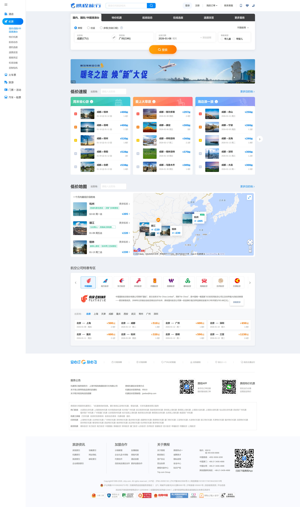

**Dependencies:** None

### REQ-1.1 Open Homepage
Open the homepage from the application URL.

**Dependencies:** None

**Scenarios:**
- Open Homepage
  - **GIVEN:** User has a browser with network access.
  - **WHEN:** Enter the website URL in the browser
  - **THEN:** The homepage opens by default.

## REQ-2 User Authentication Module
Includes multiple submodules such as account/password login, verification-code login, and the registration flow.

**Dependencies:** REQ-1

### REQ-2.1 Open Registration Entry
Open the registration page from the homepage.

**Dependencies:** REQ-1.1

**Scenarios:**
- Open Registration Entry
  - **GIVEN:** User is on the homepage.
  - **WHEN:** Click “注册” in the top-right corner of the homepage
  - **THEN:** Navigate to the registration page.

### REQ-2.2 Open Login Entry
Open the login page from the homepage.

**Dependencies:** REQ-1.1

**Scenarios:**
- Open Login Entry
  - **GIVEN:** User is on the homepage.
  - **WHEN:** Click “登录” in the top-right corner of the homepage
  - **THEN:** Navigate to the login page.

### REQ-2.3 Login Page Entry and Switching
Provide entry points to freely switch between account/password login and SMS verification-code login.
Reference: Password login 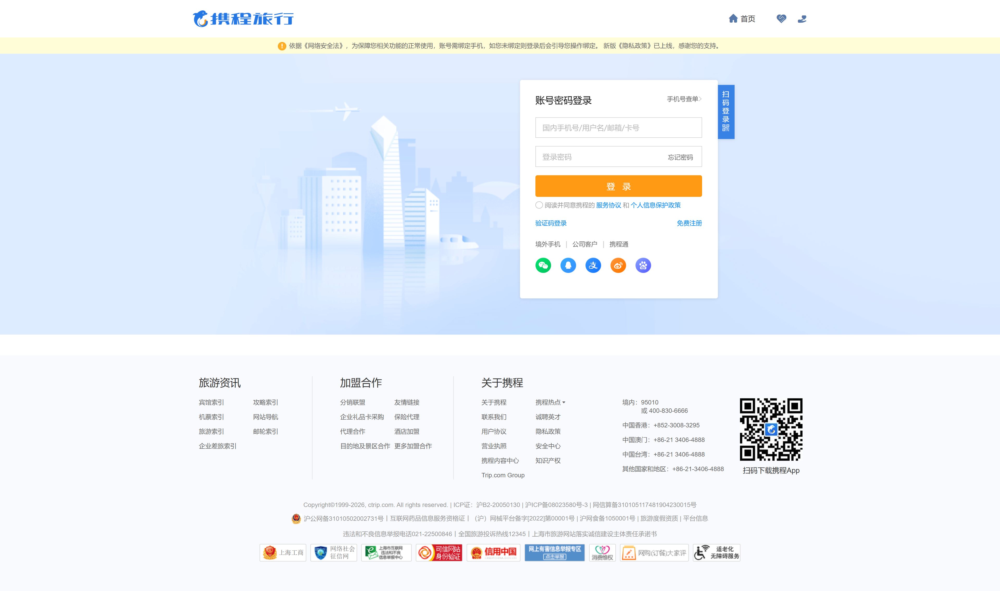
Reference: Verification-code login 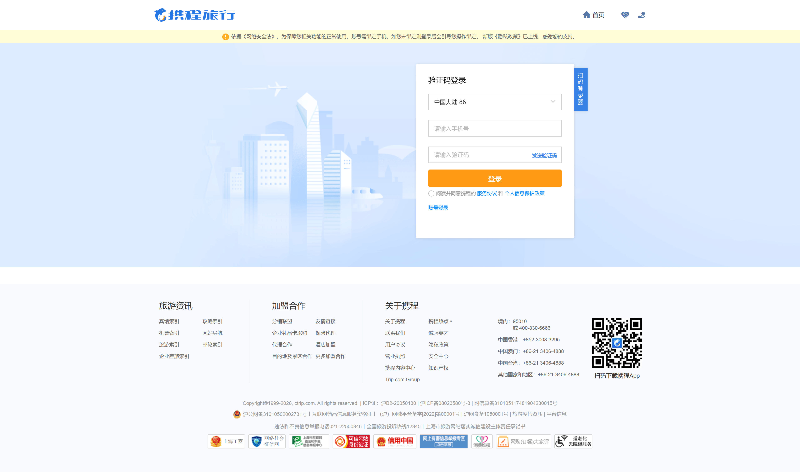

**Dependencies:** None

#### REQ-2.3.1 Enter Login Page
Open the account/password login page from the homepage.

**Dependencies:** REQ-1.1

**Scenarios:**
- Enter Login Page
  - **GIVEN:** User is on the homepage.
  - **WHEN:** Click the “登录” icon in the top-right corner of the homepage
  - **THEN:** Navigate to the account/password login page.

#### REQ-2.3.2 Switch to Verification-Code Login
Switch from account/password login to verification-code login.

**Dependencies:** REQ-2.3.1

**Scenarios:**
- Switch to Verification-Code Login
  - **GIVEN:** User is on the password login page.
  - **WHEN:** Click the “验证码登录” link
  - **THEN:** Switch to the verification-code login form.

#### REQ-2.3.3 Switch to Password Login
Switch from verification-code login to account/password login.

**Dependencies:** REQ-2.3.2

**Scenarios:**
- Switch to Password Login
  - **GIVEN:** User is on the verification-code login page.
  - **WHEN:** Click the “账号登录” link
  - **THEN:** Switch to the account/password login form.

### REQ-2.4 Account/Password Login
Users authenticate using a mobile number, username, or email together with a password.

**Dependencies:** REQ-2.3

#### REQ-2.4.1 Password Login Flow
Log in with a valid mobile number, username, or email and a password.

**Dependencies:** REQ-2.3.1

**Scenarios:**
- Password Login Flow
  - **GIVEN:** User is on the password login page.
  - **WHEN:** Enter a mainland China mobile number / username / email
  - **WHEN:** Enter the login password
  - **WHEN:** Check “阅读并同意服务协议和个人信息保护政策”
  - **GIVEN:** Account identifier and password have been entered, and the agreement has been accepted.
  - **WHEN:** Click the “登录” button
  - **THEN:** After verification, redirect to the homepage and update the status to logged in.

#### REQ-2.4.2 Exception: Username Missing
Reject password login when the account identifier is missing.

**Dependencies:** REQ-2.3.1

**Scenarios:**
- Exception: Username Missing
  - **GIVEN:** User is on the password login page.
  - **WHEN:** Do not enter a username
  - **WHEN:** Enter the login password
  - **WHEN:** Check “阅读并同意服务协议和个人信息保护政策”
  - **GIVEN:** Username is empty.
  - **WHEN:** Click the “登录” button
  - **THEN:** Show a message: “请输入用户名”.

#### REQ-2.4.3 Exception: Password Missing
Reject password login when the password is missing.

**Dependencies:** REQ-2.3.1

**Scenarios:**
- Exception: Password Missing
  - **GIVEN:** User is on the password login page.
  - **WHEN:** Enter a mainland China mobile number / username / email
  - **WHEN:** Do not enter the login password
  - **WHEN:** Check “阅读并同意服务协议和个人信息保护政策”
  - **GIVEN:** Password is empty.
  - **WHEN:** Click the “登录” button
  - **THEN:** Show a message: “请输入登录密码”.

#### REQ-2.4.4 Exception: Incorrect Username or Password
Reject password login when the account identifier or password is incorrect.

**Dependencies:** REQ-2.3.1

**Scenarios:**
- Exception: Incorrect Username or Password
  - **GIVEN:** User is on the password login page.
  - **WHEN:** Enter an incorrect username/password combination
  - **WHEN:** Check “阅读并同意服务协议和个人信息保护政策”
  - **GIVEN:** Entered credentials are incorrect.
  - **WHEN:** Click the “登录” button
  - **THEN:** Show a message: “用户名或密码错误”.

#### REQ-2.4.5 Exception: Agreement Not Accepted
Reject submission when the required agreement is not accepted.

**Dependencies:** REQ-2.3.1

**Scenarios:**
- Exception: Agreement Not Accepted
  - **GIVEN:** User is on the password login page.
  - **WHEN:** Enter a mainland China mobile number / username / email
  - **WHEN:** Enter the login password
  - **WHEN:** Do not accept the agreement
  - **GIVEN:** Agreement is not accepted.
  - **WHEN:** Click the “登录” button
  - **THEN:** Show a message: “请先阅读并勾选协议”.

### REQ-2.5 Verification-Code Login
Log in via an SMS verification code after a six-digit code is sent to the entered mobile number.

**Dependencies:** REQ-2.3

#### REQ-2.5.1 Verification-Code Login Flow
Log in with a valid mobile number and verification code.

**Dependencies:** REQ-2.3.2

**Scenarios:**
- Verification-Code Login Flow
  - **GIVEN:** User is on the verification-code login page.
  - **WHEN:** Select the country/region code (default: mainland China +86) and enter the mobile number
  - **WHEN:** Click “发送验证码”
  - **THEN:** The system sends an SMS, and the button enters a countdown state.
  - **GIVEN:** Verification code has been sent.
  - **WHEN:** Enter the 6-digit SMS verification code and accept the agreement
  - **GIVEN:** Valid verification code has been entered, and the agreement has been accepted.
  - **WHEN:** Click the “登录” button
  - **THEN:** After verification, redirect to the homepage.

#### REQ-2.5.2 Exception: Mobile Number Missing
Reject verification-code login when the mobile number is missing.

**Dependencies:** REQ-2.3.2

**Scenarios:**
- Exception: Mobile Number Missing
  - **GIVEN:** User is on the verification-code login page.
  - **WHEN:** Do not enter a mobile number
  - **GIVEN:** Mobile number is empty.
  - **WHEN:** Click “发送验证码” or “登录”
  - **THEN:** Show a message: “请输入手机号”.

#### REQ-2.5.3 Exception: Verification Code Missing
Reject verification-code login when the verification code is missing.

**Dependencies:** REQ-2.3.2

**Scenarios:**
- Exception: Verification Code Missing
  - **GIVEN:** User is on the verification-code login page.
  - **WHEN:** Enter the mobile number and send the verification code
  - **WHEN:** Do not enter the verification code
  - **WHEN:** Accept the agreement
  - **GIVEN:** Verification code is empty.
  - **WHEN:** Click the “登录” button
  - **THEN:** Show a message: “请输入验证码”.

#### REQ-2.5.4 Exception: Incorrect Verification Code
Reject verification-code login when the verification code is incorrect.

**Dependencies:** REQ-2.3.2

**Scenarios:**
- Exception: Incorrect Verification Code
  - **GIVEN:** User is on the verification-code login page.
  - **WHEN:** Enter the mobile number and send the verification code
  - **WHEN:** Enter an incorrect verification code
  - **WHEN:** Accept the agreement
  - **GIVEN:** Entered verification code is incorrect.
  - **WHEN:** Click the “登录” button
  - **THEN:** Show a message: “验证码错误”.

#### REQ-2.5.5 Exception: Agreement Not Accepted
Reject submission when the required agreement is not accepted.

**Dependencies:** REQ-2.3.2

**Scenarios:**
- Exception: Agreement Not Accepted
  - **GIVEN:** User is on the verification-code login page.
  - **WHEN:** Enter the mobile number and send the verification code
  - **WHEN:** Enter the correct verification code
  - **WHEN:** Do not accept the agreement
  - **GIVEN:** Agreement is not accepted.
  - **WHEN:** Click the “登录” button
  - **THEN:** Show a message: “请先阅读并勾选协议”.

### REQ-2.6 User Registration Flow
Guide new users to complete mobile-number verification and password setup. Users must accept the legal agreements before registration. Includes registration agreement confirmation and mobile-number verification (see sub-requirements).

**Dependencies:** REQ-2.3, REQ-1

#### REQ-2.6.1 Enter Registration Page
Enter Registration Page

**Dependencies:** REQ-1.1

**Scenarios:**
- Enter Registration Page
  - **GIVEN:** User is on the homepage.
  - **WHEN:** Click “注册” in the top-right corner of the homepage

#### REQ-2.6.2 Registration Agreement Confirmation
Show an agreement modal that requires the user to read it. Reference: 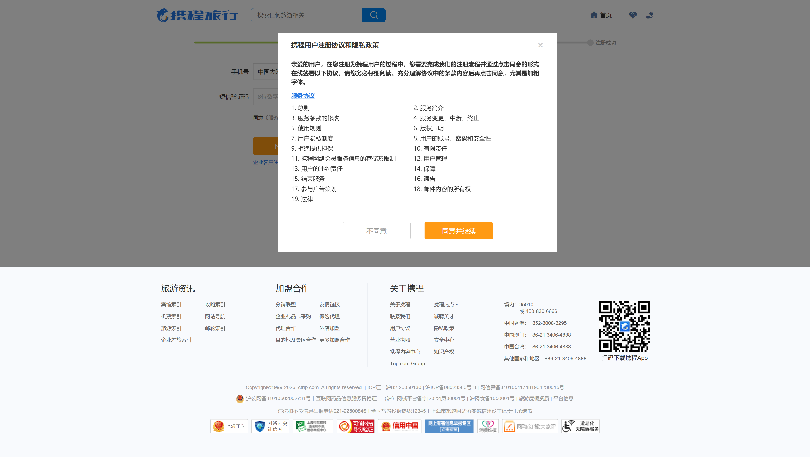

**Dependencies:** REQ-1, REQ-2

##### REQ-2.6.2.1 Trigger Registration Agreement
Trigger Registration Agreement

**Dependencies:** REQ-2.3.1

**Scenarios:**
- Trigger Registration Agreement
  - **GIVEN:** User is on the login page.
  - **WHEN:** Click “免费注册”
  - **THEN:** A dialog titled “携程用户注册协议和隐私政策” appears.
  - **GIVEN:** The registration agreement dialog is visible.
  - **WHEN:** Click “同意并继续”
  - **THEN:** Enter the mobile-number verification page.

##### REQ-2.6.2.2 Decline Registration Agreement
Decline Registration Agreement

**Dependencies:** REQ-1.1, REQ-2.6.2.1

**Scenarios:**
- Decline Registration Agreement
  - **GIVEN:** The registration agreement dialog is visible.
  - **WHEN:** Click “不同意”
  - **THEN:** Return to the Ctrip homepage.

#### REQ-2.6.3 Mobile Number Verification
The first step of registration, to verify that the phone number is real. Reference: 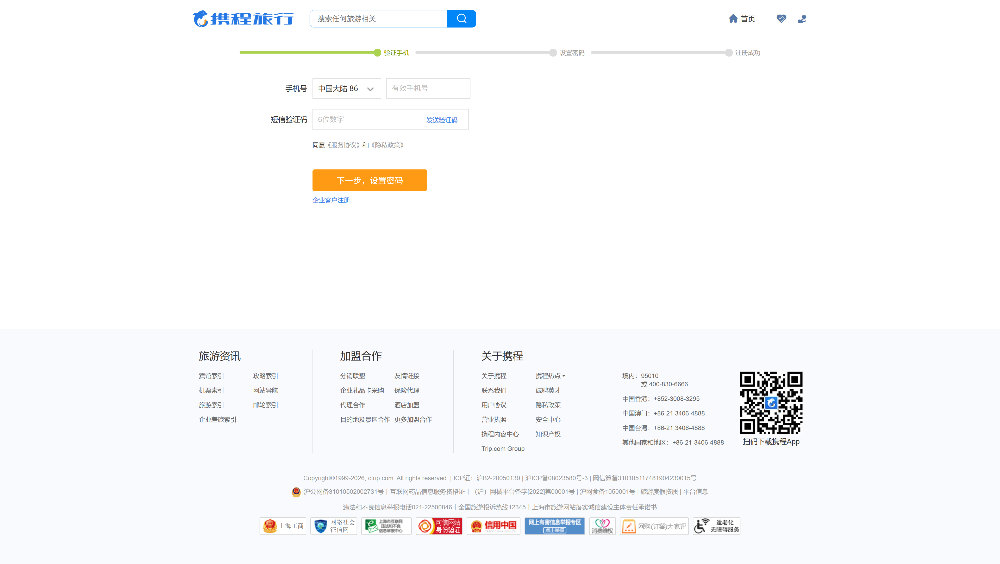

**Dependencies:** REQ-2.6.2

##### REQ-2.6.3.1 Enter Verification Information
Enter Verification Information

**Dependencies:** REQ-2.6.2.1

**Scenarios:**
- Enter Verification Information
  - **GIVEN:** User is on the mobile-number verification page.
  - **WHEN:** Enter a valid mobile number and click “发送验证码”
  - **THEN:** Receive an SMS verification code.
  - **GIVEN:** SMS verification code has been received.
  - **WHEN:** Enter the verification code and click “下一步，设置密码”
  - **THEN:** Move to the second stage of the progress bar: “设置密码”.

#### REQ-2.6.4 Set Password and Complete Registration
The second step of registration: set the login password and complete registration.

**Dependencies:** REQ-2.6.3

##### REQ-2.6.4.1 Set Password and Complete Registration
Set Password and Complete Registration

**Dependencies:** REQ-2.6.3.1

**Scenarios:**
- Set Password and Complete Registration
  - **GIVEN:** User is on the set-password step.
  - **WHEN:** Enter the login password
  - **WHEN:** Re-enter the password to confirm
  - **GIVEN:** Password and confirmation password match.
  - **WHEN:** Click “完成注册”
  - **THEN:** Registration succeeds, show “注册成功”, and navigate to the account/password login page.

##### REQ-2.6.4.2 Exception: Passwords Do Not Match
Exception Passwords Do Not Match

**Dependencies:** REQ-2.6.3.1

**Scenarios:**
- Exception: Passwords Do Not Match
  - **GIVEN:** User is on the set-password step.
  - **WHEN:** Enter the login password
  - **WHEN:** Enter a different confirmation password
  - **GIVEN:** Password and confirmation password do not match.
  - **WHEN:** Click “完成注册”
  - **THEN:** Show a message: “两次输入的密码不一致”.

##### REQ-2.6.4.3 Exception: Password Too Weak
Exception Password Too Weak

**Dependencies:** REQ-2.6.3.1

**Scenarios:**
- Exception: Password Too Weak
  - **GIVEN:** User is on the set-password step.
  - **WHEN:** Enter an overly simple password
  - **GIVEN:** Password strength requirements are not met.
  - **WHEN:** Click “完成注册”
  - **THEN:** Show a message: “密码需包含字母和数字，且长度不小于8位”.

### REQ-2.7 Log Out
Log out and remove the current login state from the session.
Logout entry: 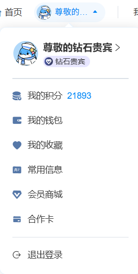

**Dependencies:** None

#### REQ-2.7.1 Log Out
Log Out

**Dependencies:** None

**Scenarios:**
- Log Out
  - **GIVEN:** User is logged in and is on the homepage.
  - **WHEN:** Hover the mouse over “尊敬的...” in the top-right corner of the homepage
  - **WHEN:** Click “退出登录”
  - **THEN:** Clear the login state; on the homepage, “尊敬的...” changes to the “登录” button.

## REQ-3 Flight Search Module
Provide search for domestic and international routes. Support multiple trip types, parameter configuration, and result display.

**Dependencies:** REQ-1

### REQ-3.1 Homepage Quick Flight Search
The homepage shows a quick flight search form by default. Reference: 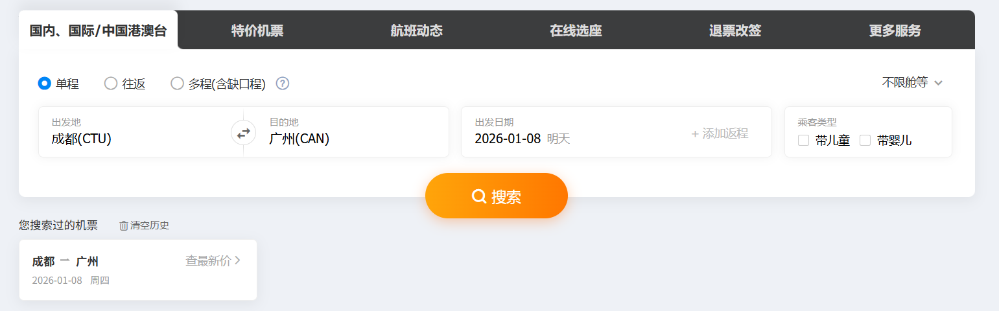

**Dependencies:** None

### REQ-3.2 Basic Trip Parameter Configuration
The core search input area, including trip type, origin/destination, dates, and passenger types.

**Dependencies:** None

#### REQ-3.2.1 Trip Type Selection
Trip Type Selection

**Dependencies:** REQ-1.1

**Scenarios:**
- Trip Type Selection
  - **GIVEN:** User can see the flight search form on the homepage.
  - **WHEN:** Switch the radio button among “单程”, “往返”, and “多程”
  - **THEN:** The “出发日期” area dynamically adds or removes the “返回日期” input.

#### REQ-3.2.2 Swap Origin and Destination
Swap Origin and Destination

**Dependencies:** REQ-1.1

**Scenarios:**
- Swap Origin and Destination
  - **GIVEN:** User can see the flight search form on the homepage.
  - **WHEN:** Click the “双向箭头” icon between the origin and destination
  - **THEN:** The text values of origin and destination are swapped immediately.

#### REQ-3.2.3 Exception: Same-City Validation
Exception Same-City Validation

**Dependencies:** REQ-1.1

**Scenarios:**
- Exception: Same-City Validation
  - **GIVEN:** User can see the flight search form on the homepage.
  - **WHEN:** In the destination input, enter the same city as the origin (e.g., 成都)
  - **GIVEN:** Origin and destination are the same.
  - **WHEN:** Click “搜索”
  - **THEN:** The system shows a message: “出发城市和到达城市不能相同”, and navigation is blocked.

#### REQ-3.2.4 Exception: Past-Date Validation
Exception Past-Date Validation

**Dependencies:** REQ-1.1

**Scenarios:**
- Exception: Past-Date Validation
  - **GIVEN:** User can see the date picker in the flight search form.
  - **WHEN:** Manually try selecting a date earlier than today
  - **THEN:** Past dates are disabled in the calendar and cannot be selected.

#### REQ-3.2.5 City Selector
Provide a city selection panel for origin and destination. Support hot-city recommendations and pinyin-initial search. Reference: 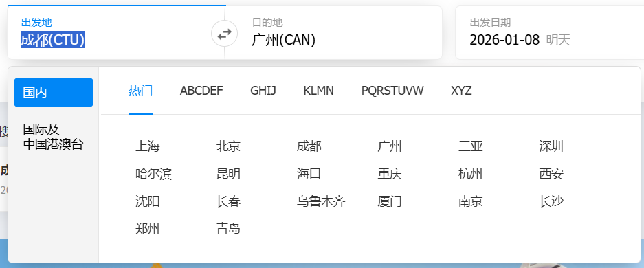

**Dependencies:** None

##### REQ-3.2.5.1 Select a Hot City
Select a Hot City

**Dependencies:** REQ-3.2.1

**Scenarios:**
- Select a Hot City
  - **GIVEN:** User can see the origin input in the flight search form.
  - **WHEN:** Click the origin input field
  - **THEN:** The city selection panel pops up, with the “热门” tab shown by default.
  - **GIVEN:** The city selection panel is open.
  - **WHEN:** Click “成都”
  - **THEN:** The origin input is filled with “成都(CTU)”, and the panel closes automatically.

##### REQ-3.2.5.2 Find Cities by Pinyin Group
Find Cities by Pinyin Group

**Dependencies:** REQ-3.2.1

**Scenarios:**
- Find Cities by Pinyin Group
  - **GIVEN:** User can see the destination input in the flight search form.
  - **WHEN:** Click the destination input field
  - **THEN:** The city selection panel pops up.
  - **GIVEN:** The city selection panel is open.
  - **WHEN:** Click the “GHIJ” tab
  - **THEN:** The list switches to the city section starting with G/H/I/J.
  - **WHEN:** Select “广州”
  - **THEN:** The destination input is filled with “广州(CAN)”, and the panel closes automatically.

#### REQ-3.2.6 Date Picker
Provide a calendar control for users to select departure and return dates. 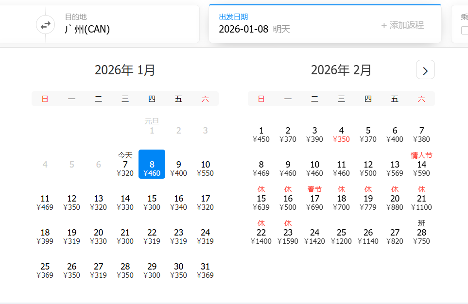

**Dependencies:** None

##### REQ-3.2.6.1 Select Departure Date
Select Departure Date

**Dependencies:** REQ-3.2.5.1

**Scenarios:**
- Select Departure Date
  - **GIVEN:** User can see the departure date input in the flight search form.
  - **WHEN:** Click the departure date input field
  - **THEN:** The calendar opens, showing the current month and daily flight prices (e.g., ￥460).
  - **GIVEN:** The calendar is open.
  - **WHEN:** Click a future date (e.g., 2026-01-08)
  - **THEN:** The input shows “2026-01-08 明天”, and the calendar closes.

##### REQ-3.2.6.2 Select a Past Date
Select a Past Date

**Dependencies:** None

**Scenarios:**
- Select a Past Date
  - **GIVEN:** User can see the departure date input in the flight search form.
  - **WHEN:** Click the departure date input field
  - **GIVEN:** The calendar is open.
  - **WHEN:** Click a past date
  - **THEN:** It cannot be clicked; past dates are disabled.

#### REQ-3.2.7 Add Return Trip
In one-way search mode, use the “添加返程” entry to quickly switch to round-trip mode and set a return date. 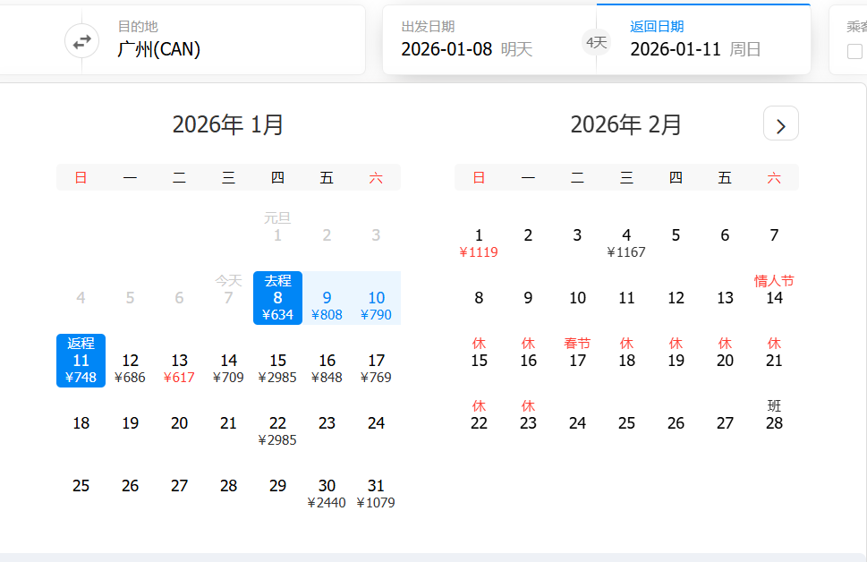

**Dependencies:** REQ-3.2.6

##### REQ-3.2.7.1 Enable Return Trip
Enable Return Trip

**Dependencies:** REQ-3.2.6.1

**Scenarios:**
- Enable Return Trip
  - **GIVEN:** User is in one-way mode and can see the date inputs.
  - **WHEN:** Click the “+ 添加返程” button to the right of the date input
  - **THEN:** The trip type automatically switches to “往返”, and the calendar opens to select a return date.
  - **GIVEN:** The return-date calendar is open.
  - **WHEN:** Select a date later than the departure date (e.g., 2026-01-11)
  - **THEN:** The selected return date is shown, the input displays “4天”, and the round-trip configuration is completed.

##### REQ-3.2.7.2 Exception: Return Date Earlier Than Departure
Exception Return Date Earlier Than Departure

**Dependencies:** REQ-3.2.7.1

**Scenarios:**
- Exception: Return Date Earlier Than Departure
  - **GIVEN:** The return-date calendar is open and a departure date is selected.
  - **WHEN:** In the return-date calendar, try selecting a date earlier than the departure date
  - **THEN:** Dates earlier than the departure date are disabled and cannot be selected.

### REQ-3.3 Passenger and Cabin Preferences
Configure traveler types and cabin class preferences.

**Dependencies:** None

#### REQ-3.3.1 Configure Special Passengers
Configure Special Passengers

**Dependencies:** REQ-1.1

**Scenarios:**
- Configure Special Passengers
  - **GIVEN:** User can see passenger type options in the flight search form.
  - **WHEN:** Check “带儿童” or “带婴儿”
  - **THEN:** Search results are filtered to flights that support the selected special ticket types.

#### REQ-3.3.2 Filter by Cabin Class
Filter by Cabin Class

**Dependencies:** REQ-1.1

**Scenarios:**
- Filter by Cabin Class
  - **GIVEN:** User can see the cabin class selector in the flight search form.
  - **WHEN:** In the “不限舱等” dropdown, select a specific cabin class (e.g., economy, business/first)
  - **THEN:** The selected cabin class is updated in the UI.

### REQ-3.4 Search Execution and History
Execute searches and manage the user’s search history.

**Dependencies:** REQ-3.2

#### REQ-3.4.1 Run a Standard Search
Run a Standard Search

**Dependencies:** REQ-3.2.1

**Scenarios:**
- Run a Standard Search
  - **GIVEN:** Origin, destination, and dates have been filled in.
  - **WHEN:** Click the orange “搜索” button
  - **THEN:** Navigate to the flight search results page (Flight Result Page).

#### REQ-3.4.2 Quickly Reuse Search History
Quickly Reuse Search History

**Dependencies:** REQ-1.1

**Scenarios:**
- Quickly Reuse Search History
  - **GIVEN:** The search box shows history items.
  - **WHEN:** Click a history item below the search box (e.g., 成都 - 广州)
  - **THEN:** The system auto-fills the corresponding locations and the latest dates, then runs the search.

### REQ-3.5 Results Display and Advanced Filtering
The results page shows a flight list, with a low-price calendar and multi-dimensional filters. Reference: 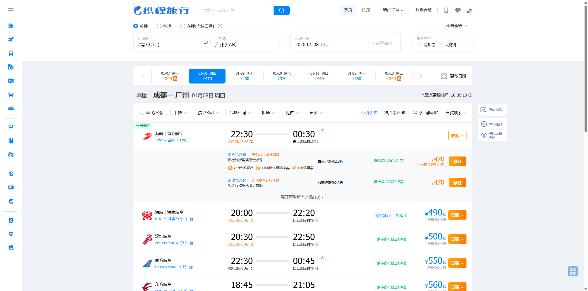

**Dependencies:** REQ-3.4

#### REQ-3.5.1 Top Search Criteria Bar
Allow users to modify search criteria (origin, destination, dates, cabin class) directly on the results page and re-run the search. 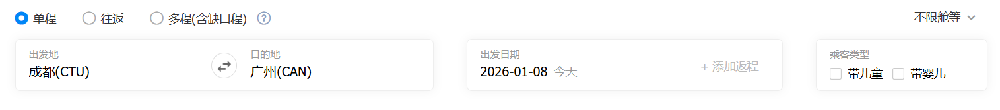

**Dependencies:** None

##### REQ-3.5.1.1 Modify Search Criteria
Modify Search Criteria

**Dependencies:** REQ-3.4.1

**Scenarios:**
- Modify Search Criteria
  - **GIVEN:** User is on the flight search results page.
  - **WHEN:** In the top search bar, modify the dates or cabin class
  - **THEN:** The page does not navigate; the flight list below refreshes directly.

#### REQ-3.5.2 Low-Price Calendar and Date Switching
Located above the list, showing the minimum fares for nearby dates and supporting quick date switching. 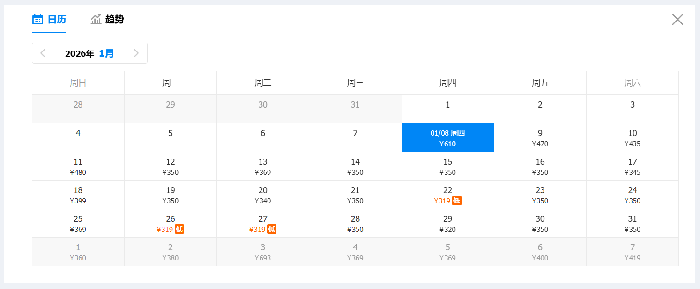

**Dependencies:** None

##### REQ-3.5.2.1 Switch to a Nearby Date
Switch to a Nearby Date

**Dependencies:** REQ-3.4.1

**Scenarios:**
- Switch to a Nearby Date
  - **GIVEN:** User is on the flight search results page and can see the date bar.
  - **WHEN:** Click a date in the date bar that has the low-price label “¥320”
  - **THEN:** The list refreshes to show flights for that date, and the displayed prices update.

##### REQ-3.5.2.2 View More Dates
View More Dates

**Dependencies:** None

**Scenarios:**
- View More Dates
  - **GIVEN:** User is on the flight search results page and can see the date bar.
  - **WHEN:** Click the “更多日期” calendar icon
  - **THEN:** Expand the calendar view, showing price trends for the whole month.

##### REQ-3.5.2.3 Switch to Next Week
Switch to Next Week

**Dependencies:** None

**Scenarios:**
- Switch to Next Week
  - **GIVEN:** User is on the flight search results page and can see the date bar.
  - **WHEN:** Click the ">" button
  - **THEN:** Switch to dates in the next week.

#### REQ-3.5.3 Filter and Sort Toolbar
Provide multi-dimensional flight filtering (nonstop/stopover, airline, time, airport) and sorting.

**Dependencies:** None

##### REQ-3.5.3.1 Combined Filters
Combined Filters

**Dependencies:** None

**Scenarios:**
- Combined Filters
  - **GIVEN:** User is on the flight search results page and can see the filter toolbar.
  - **WHEN:** Under “直飞/经停”, select “直飞”
  - **THEN:** The list hides all transfer/stopover flights.
  - **WHEN:** In the “航空公司” dropdown, select “南方航空”
  - **THEN:** The list shows only nonstop flights by “南方航空”.

##### REQ-3.5.3.2 Sort by Price
Sort by Price

**Dependencies:** None

**Scenarios:**
- Sort by Price
  - **GIVEN:** User is on the flight search results page and can see sorting options.
  - **WHEN:** Click “低价优先”
  - **THEN:** The flight list is re-ordered by price from low to high.

##### REQ-3.5.3.3 Sort by On-Time Performance
Sort by On-Time Performance

**Dependencies:** None

**Scenarios:**
- Sort by On-Time Performance
  - **GIVEN:** User is on the flight search results page and can see sorting options.
  - **WHEN:** Click “准点率高-低”
  - **THEN:** The flight list is re-ordered by on-time performance from high to low; the on-time rate is randomly generated for flights.

##### REQ-3.5.3.4 Sort by Departure Time
Sort by Departure Time

**Dependencies:** None

**Scenarios:**
- Sort by Departure Time
  - **GIVEN:** User is on the flight search results page and can see sorting options.
  - **WHEN:** Click “起飞时间早-晚”
  - **THEN:** The flight list is re-ordered by departure time from early to late.

#### REQ-3.5.4 Flight List and Booking
Show flight detail cards, support expanding to view different fares and refund/change rules, and allow booking.

**Dependencies:** None

##### REQ-3.5.4.1 Expand/Collapse Flight Details
Expand/Collapse Flight Details

**Dependencies:** REQ-3.4.1

**Scenarios:**
- Expand/Collapse Flight Details
  - **GIVEN:** User is on the flight search results page and can see a flight card.
  - **WHEN:** Click the “收起/展开” button on the right side of a flight card (or the price area)
  - **THEN:** Expand to show all cabin fare options for the flight (e.g., economy 2.3折, premium economy) and refund/change rules.
  - **GIVEN:** Flight details are expanded.
  - **WHEN:** Click again
  - **THEN:** Collapse the details list.

##### REQ-3.5.4.2 Select a Fare and Book
Select a Fare and Book

**Dependencies:** REQ-3.5.4.1

**Scenarios:**
- Select a Fare and Book
  - **GIVEN:** Flight details are expanded and fare options are visible.
  - **WHEN:** Click the orange “预订” button at the end of a fare row
  - **THEN:** Enter the order booking page (Order Booking Page).

##### REQ-3.5.4.3 Exception: No Search Results
Exception No Search Results

**Dependencies:** REQ-3.4.1

**Scenarios:**
- Exception: No Search Results
  - **GIVEN:** No flights match the search criteria.
  - **WHEN:** View the flight list area
  - **THEN:** The list area shows “未找到相关航班” and suggests “修改搜索条件”.

## REQ-4 Order and Booking Module
Drive the flight booking flow, payment settlement, and order lifecycle management.

**Dependencies:** REQ-3

### REQ-4.1 Booking Page Information Entry and Display
Integrate the booking page’s core features, including travel reminders, passenger management, contact information, and the order summary. 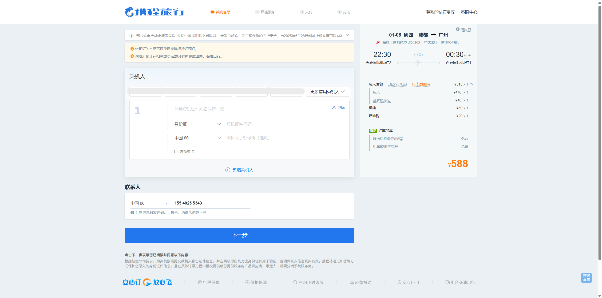

**Dependencies:** REQ-3.5

#### REQ-4.1.1 Top Travel Reminders
Show airline restrictions and important notices at the top (e.g., rules for carrying power banks). 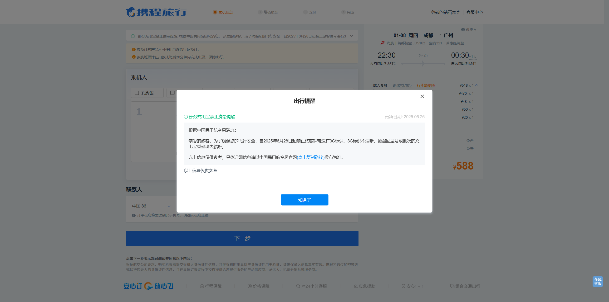

**Dependencies:** None

##### REQ-4.1.1.1 View Reminder Details
View Reminder Details

**Dependencies:** None

**Scenarios:**
- View Reminder Details
  - **GIVEN:** User is on the order booking page and can see the travel reminders notice bar.
  - **WHEN:** Click the expand arrow on the right side of the notice bar
  - **THEN:** Expand downward to show detailed text-and-image regulations from the Civil Aviation Administration of China about power banks and baggage allowance.

#### REQ-4.1.2 Select Frequent Passengers
Show a multi-select list of frequent passengers under the current account, supporting quick fill.

**Dependencies:** None

##### REQ-4.1.2.1 Quickly Select Passengers
Quickly Select Passengers

**Dependencies:** REQ-4.1.1.1

**Scenarios:**
- Quickly Select Passengers
  - **GIVEN:** User can see the frequent passenger list.
  - **WHEN:** Select the checkboxes such as “张三” and “李四”
  - **THEN:** Passenger info cards are automatically generated below and filled with the corresponding identity information.

#### REQ-4.1.3 Manual Passenger Entry
Provide a blank form for entering ad hoc passenger information that is not saved, with validation for name and ID consistency.

**Dependencies:** None

##### REQ-4.1.3.1 Enter ID Information (Normal Flow)
Enter ID Information (Normal Flow)

**Dependencies:** None

**Scenarios:**
- Enter ID Information (Normal Flow)
  - **GIVEN:** User is on the order booking page and can see the manual passenger entry form.
  - **WHEN:** Enter the name and a valid ID number
  - **GIVEN:** Name and ID number have been entered.
  - **WHEN:** Move focus out of the input
  - **THEN:** Validation passes with no error messages.

##### REQ-4.1.3.2 Exception: Invalid ID Number Format
Exception Invalid ID Number Format

**Dependencies:** None

**Scenarios:**
- Exception: Invalid ID Number Format
  - **GIVEN:** User is on the order booking page and can see the manual passenger entry form.
  - **WHEN:** Enter the name and an invalid ID number (e.g., incorrect length or checksum digit)
  - **GIVEN:** An invalid ID number has been entered.
  - **WHEN:** Move focus out of the input
  - **THEN:** Show a message: “请输入正确的证件号码”.

#### REQ-4.1.4 Add a New Passenger
Provide an entry to add a new frequent passenger to the account.

**Dependencies:** None

##### REQ-4.1.4.1 Trigger Add Passenger
Trigger Add Passenger

**Dependencies:** None

**Scenarios:**
- Trigger Add Passenger
  - **GIVEN:** User can see the passenger list area on the order booking page.
  - **WHEN:** Click the “+ 新增乘机人” button below the list
  - **THEN:** A modal appears to edit the new passenger.

#### REQ-4.1.5 Contact Information
Confirm the contact mobile number used to receive ticketing SMS messages; default to the currently logged-in user.

**Dependencies:** None

##### REQ-4.1.5.1 Modify Contact Mobile Number
Modify Contact Mobile Number

**Dependencies:** None

**Scenarios:**
- Modify Contact Mobile Number
  - **GIVEN:** User can see the contact information section on the order booking page.
  - **WHEN:** Modify the default mobile number
  - **THEN:** Validate that the input matches a valid mainland China mobile number format.

#### REQ-4.1.6 Right-Side Flight Information
The floating sidebar shows flight schedule, airports, aircraft type, and real-time fee breakdown (adult fare, airport construction fee and fuel surcharge).

**Dependencies:** None

##### REQ-4.1.6.1 Real-Time Fee Calculation
Real-Time Fee Calculation

**Dependencies:** REQ-4.1.2.1

**Scenarios:**
- Real-Time Fee Calculation
  - **GIVEN:** User can see the fee breakdown sidebar on the order booking page.
  - **WHEN:** Increase or decrease the number of passengers
  - **THEN:** The large “订单总价” amount in the sidebar and the “x 1” quantity in the breakdown update accordingly.

### REQ-4.2 Value-Added Services and Trip Protection
In step 2 of booking, provide optional items such as insurance, baggage allowance, airport transfer, and airport services. Reference: 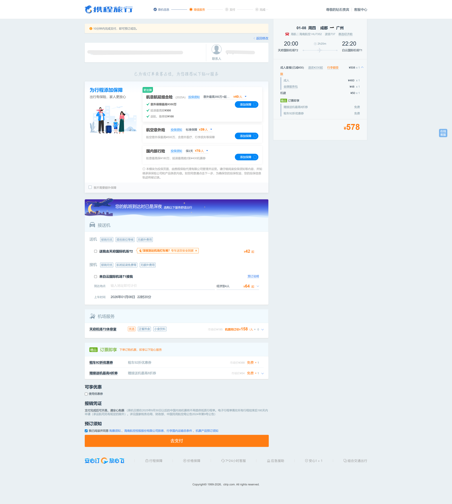

**Dependencies:** REQ-4.1

#### REQ-4.2.1 Trip Protection (Insurance Services)
Provide multiple protection plans such as flight delay combo insurance, aviation accident insurance, and domestic travel insurance.

**Dependencies:** None

##### REQ-4.2.1.1 Add Combo Insurance
Add Combo Insurance

**Dependencies:** None

**Scenarios:**
- Add Combo Insurance
  - **GIVEN:** User is on booking step 2 and can see the insurance section.
  - **WHEN:** Click the add button or price button to the right of “航意航延组合险”
  - **THEN:** The button state changes to “已选”, and the fee breakdown on the right increases immediately (e.g., ¥40/person).

##### REQ-4.2.1.2 View Insurance Terms
View Insurance Terms

**Dependencies:** None

**Scenarios:**
- View Insurance Terms
  - **GIVEN:** User is on booking step 2 and can see the insurance section.
  - **WHEN:** Click the “查看详情” or “保险条款” link next to the insurance name
  - **THEN:** A modal shows the coverage scope, limits, and claim process.

#### REQ-4.2.2 Baggage Allowance Service
Show the free baggage allowance for the current flight and provide options to purchase extra allowance.

**Dependencies:** None

##### REQ-4.2.2.1 View Free Baggage Allowance
View Free Baggage Allowance

**Dependencies:** None

**Scenarios:**
- View Free Baggage Allowance
  - **GIVEN:** User is on booking step 2 and can see the “行李额” section.
  - **WHEN:** View the description in the “行李额” section
  - **THEN:** Show “已为你订单免费携带XXKG行李” or a similar message.

##### REQ-4.2.2.2 Purchase Extra Baggage Allowance
Purchase Extra Baggage Allowance

**Dependencies:** None

**Scenarios:**
- Purchase Extra Baggage Allowance
  - **GIVEN:** User is on booking step 2 and can see extra baggage options.
  - **WHEN:** Select the extra weight to purchase (e.g., +10KG)
  - **THEN:** The cost is added to the total, and the updated total allowance is shown.

#### REQ-4.2.3 Airport Transfer and Transportation Services
Provide transfer reservation options for origin/destination cities, including drop-off, pick-up, and taxi services.

**Dependencies:** None

##### REQ-4.2.3.1 Reserve an Airport Drop-Off Service
Reserve an Airport Drop-Off Service

**Dependencies:** None

**Scenarios:**
- Reserve an Airport Drop-Off Service
  - **GIVEN:** User is on booking step 2 and can see transfer/transportation options.
  - **WHEN:** Select “送我去” or “接送机”
  - **GIVEN:** A transfer service option is selected.
  - **WHEN:** Enter or confirm the pickup address
  - **THEN:** The system calculates the estimated cost (e.g., from ¥42); after selection, the fee is added to the total.

#### REQ-4.2.4 Airport Value-Added Services (Lounge/Security Check)
Support purchasing airport VIP lounge services (e.g., Tianfu Airport T2 lounge) and fast-track security check services.

**Dependencies:** None

##### REQ-4.2.4.1 Purchase Lounge Service
Purchase Lounge Service

**Dependencies:** None

**Scenarios:**
- Purchase Lounge Service
  - **GIVEN:** User is on booking step 2 and can see airport value-added service cards.
  - **WHEN:** Click the lounge benefit card to place the order
  - **THEN:** The lounge service is added to the order and the amount on the right updates.

#### REQ-4.2.5 Real-Time Fee Breakdown Calculation
The floating panel on the right summarizes all fees in real time, including flight fares, airport construction fee and fuel surcharge, and all value-added services listed above.

**Dependencies:** REQ-4.1, REQ-4.2.1, REQ-4.2.2, REQ-4.2.3, REQ-4.2.4

##### REQ-4.2.5.1 Linked Pricing for Value-Added Services
Linked Pricing for Value-Added Services

**Dependencies:** REQ-4.1.2.1

**Scenarios:**
- Linked Pricing for Value-Added Services
  - **GIVEN:** User is on a booking page with the fee breakdown panel visible.
  - **WHEN:** On the left, select any insurance or transfer service
  - **THEN:** The “订单总价” number on the right updates, and clicking the “明细” dropdown arrow shows the new fee items.

##### REQ-4.2.5.2 Auto Deduction When Removing Services
Auto Deduction When Removing Services

**Dependencies:** REQ-4.2.5.1

**Scenarios:**
- Auto Deduction When Removing Services
  - **GIVEN:** At least one value-added service is selected.
  - **WHEN:** Deselect a selected value-added service
  - **THEN:** The total deducts the corresponding amount, and the item is removed from the breakdown.

### REQ-4.3 Secure Payment Flow
The cashier page after order submission. Support multiple payment methods and time-limited payment. Reference: 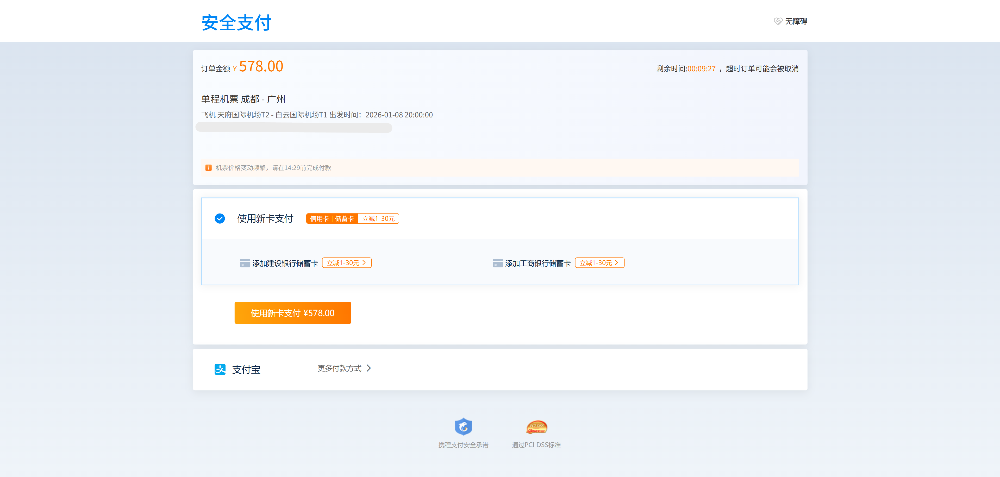

**Dependencies:** REQ-4.2

#### REQ-4.3.1 Payment Countdown Reminder
Payment Countdown Reminder

**Dependencies:** None

**Scenarios:**
- Payment Countdown Reminder
  - **GIVEN:** An order has been submitted and is awaiting payment.
  - **WHEN:** Enter the payment page
  - **THEN:** The top shows “剩余时间:00:09:27”, indicating that the order will be cancelled if it times out.

#### REQ-4.3.2 Select Payment Method
Select Payment Method

**Dependencies:** None

**Scenarios:**
- Select Payment Method
  - **GIVEN:** User is on the payment page.
  - **WHEN:** Click “使用新卡支付” or “支付宝”
  - **THEN:** Simulate a successful payment.

### REQ-4.4 Order Management Center (Order List)
Show the user’s historical and current order list, with multi-status filtering and entry points for core actions.
Order entry: 
Reference: 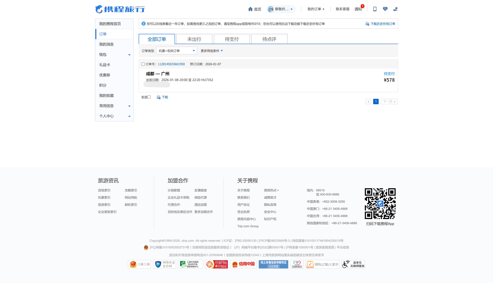

**Dependencies:** None

#### REQ-4.4.1 Enter Order Center
Enter Order Center

**Dependencies:** None

**Scenarios:**
- Enter Order Center
  - **GIVEN:** User is on the homepage.
  - **WHEN:** Hover the mouse over “订单” in the top-right corner of the homepage
  - **THEN:** A dropdown menu appears.
  - **GIVEN:** The orders dropdown menu is visible.
  - **WHEN:** Click “机票+相关订单”
  - **THEN:** Navigate to the orders page.

#### REQ-4.4.2 Order Status Tabs
Provide quick switching among four core statuses: “全部订单”, “未出行”, “待支付”, and “待点评”.

**Dependencies:** None

##### REQ-4.4.2.1 Switch to Pending Payment
Switch to Pending Payment

**Dependencies:** None

**Scenarios:**
- Switch to Pending Payment
  - **GIVEN:** User is on the orders page and can see the status tabs.
  - **WHEN:** Click the “待支付” tab
  - **THEN:** The list shows only orders in “待支付” status, and each order shows a “去支付” button.

##### REQ-4.4.2.2 Switch to Not Traveled
Switch to Not Traveled

**Dependencies:** None

**Scenarios:**
- Switch to Not Traveled
  - **GIVEN:** User is on the orders page and can see the status tabs.
  - **WHEN:** Click the “未出行” tab
  - **THEN:** The list shows only valid orders that have not been used for travel. If there are no orders, show an empty state: “暂时没有相关订单”.

##### REQ-4.4.2.3 Switch to Pending Review
Switch to Pending Review

**Dependencies:** None

**Scenarios:**
- Switch to Pending Review
  - **GIVEN:** User is on the orders page and can see the status tabs.
  - **WHEN:** Click the “待点评” tab
  - **THEN:** The list shows orders with completed trips but no written reviews.

##### REQ-4.4.2.4 Switch to All Orders
Switch to All Orders

**Dependencies:** None

**Scenarios:**
- Switch to All Orders
  - **GIVEN:** User is on the orders page and can see the status tabs.
  - **WHEN:** Click the “全部订单” tab
  - **THEN:** The list shows all historical and current orders.

#### REQ-4.4.3 List Filter Toolbar
Support filtering by order type (such as flights and hotels), booking date range, and searching via a keyword input.

**Dependencies:** None

##### REQ-4.4.3.1 Search Historical Orders
Search Historical Orders

**Dependencies:** None

**Scenarios:**
- Search Historical Orders
  - **GIVEN:** User is on the orders page and can see the filter toolbar.
  - **WHEN:** Select the “订单号” search field and enter an order number
  - **GIVEN:** An order number has been entered.
  - **WHEN:** Click the search icon
  - **THEN:** Precisely show the matching order record.

#### REQ-4.4.4 Order List Card
Each list item shows summary info: order number, booking date, itinerary (e.g., 成都-广州), flight number, total price, and current status.

**Dependencies:** None

##### REQ-4.4.4.1 View Order Details
View Order Details

**Dependencies:** None

**Scenarios:**
- View Order Details
  - **GIVEN:** User is on the orders page and can see an order card.
  - **WHEN:** Click the order area or the “待支付” status text
  - **THEN:** Navigate to the order detail page.

### REQ-4.5 Order Details and Actions
Show the full fulfillment information for a specific order and entry points for subsequent actions. Reference: 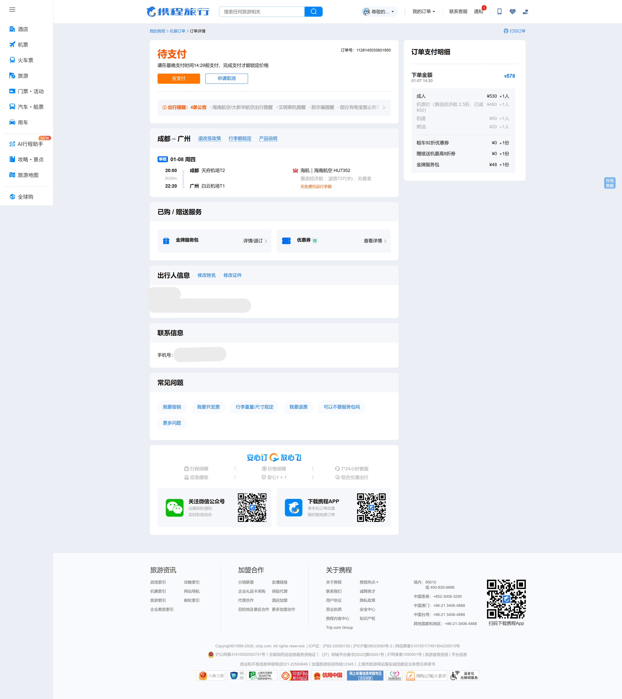

**Dependencies:** REQ-4.4

#### REQ-4.5.1 Order Status and Core Actions Area
The orange status bar at the top shows the current status (e.g., “待支付”), countdown reminder, and core action buttons (“去支付”, “取消订单”).

**Dependencies:** None

##### REQ-4.5.1.1 Pending Payment Countdown
Pending Payment Countdown

**Dependencies:** None

**Scenarios:**
- Pending Payment Countdown
  - **GIVEN:** User is on an order detail page for a pending-payment order.
  - **WHEN:** Review the top status bar
  - **THEN:** Show “建议在...内完成支付”, and the countdown decreases dynamically.

##### REQ-4.5.1.2 Cancel a Pending Payment Order
Cancel a Pending Payment Order

**Dependencies:** None

**Scenarios:**
- Cancel a Pending Payment Order
  - **GIVEN:** User is on an order detail page for a pending-payment order.
  - **WHEN:** Click the “取消订单” link below the status bar
  - **THEN:** A confirmation dialog appears; after confirmation, the order is closed.

#### REQ-4.5.2 Flight Itinerary Details
Show detailed information such as departure/arrival times, terminals, airline, flight number, and operating carrier.

**Dependencies:** None

##### REQ-4.5.2.1 View Refund/Change Rules
View Refund/Change Rules

**Dependencies:** None

**Scenarios:**
- View Refund/Change Rules
  - **GIVEN:** User is on an order detail page and can see the flight itinerary section.
  - **WHEN:** Click the “退改规则” link
  - **THEN:** Expand to show refund fee rates and change conditions for the cabin class.

#### REQ-4.5.3 Purchased Value-Added Services
Show non-flight products associated with the order, such as “全程无忧包” and “优惠券”, and their service status.

**Dependencies:** None

#### REQ-4.5.4 Travelers and Contact Information
Show a list of all passengers’ names, masked ID numbers, and the contact mobile number.

**Dependencies:** None

#### REQ-4.5.5 Payment Breakdown Sidebar
Fixed on the right, showing the order total and a list breakdown of adult fare, taxes/fees, and insurance fees.

**Dependencies:** None

## REQ-5 Common Information Management
A core submodule of the user center, used to centrally manage frequently used traveler information, addresses, contacts, and reimbursement receipts during booking.
Enter personal center from the homepage: 
In Personal Info (currently includes order management), add common information items in the sidebar, which can be collapsed/expanded.

**Dependencies:** REQ-2

### REQ-5.1 Enter Personal Center
Enter Personal Center

**Dependencies:** None

**Scenarios:**
- Enter Personal Center
  - **GIVEN:** User is logged in and is on the homepage.
  - **WHEN:** Hover the mouse over “尊敬的...” on the homepage
  - **THEN:** A dropdown menu appears, containing “尊敬的用户”.
  - **GIVEN:** The user menu dropdown is visible.
  - **WHEN:** Click “尊敬的用户”
  - **THEN:** Navigate to the personal center, showing the orders page by default.

### REQ-5.2 Expand/Collapse Common Information
Expand/Collapse Common Information

**Dependencies:** None

**Scenarios:**
- Expand/Collapse Common Information
  - **GIVEN:** User is in the personal center and can see the sidebar.
  - **WHEN:** Click “常用信息” in the sidebar
  - **THEN:** Collapse or expand “常用信息”, including “常用旅客信息”, “常用联系人”, “常用报销凭证”, and “常用地址”.

### REQ-5.3 Frequent Traveler Information Management
Support CRUD operations for passengers/travelers’ identity information.

**Dependencies:** None

#### REQ-5.3.1 Traveler List Display and Search
Display saved traveler name, mobile number, document type, and masked document number in a table. Support fuzzy search by name.
Frequent traveler list page 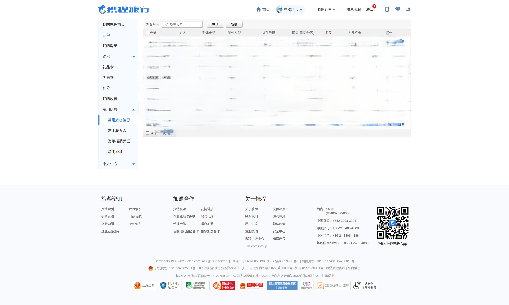

**Dependencies:** None

##### REQ-5.3.1.1 Search for a Traveler
Search for a Traveler

**Dependencies:** None

**Scenarios:**
- Search for a Traveler
  - **GIVEN:** User is on the frequent traveler list page.
  - **WHEN:** Enter a traveler name (e.g., “张”) in the search box and click query
  - **THEN:** The list filters immediately and shows only matching traveler records.

##### REQ-5.3.1.2 No Matching Traveler Found
No Matching Traveler Found

**Dependencies:** None

**Scenarios:**
- No Matching Traveler Found
  - **GIVEN:** User is on the frequent traveler list page.
  - **WHEN:** Enter a traveler name (e.g., “aa”) in the search box and click query
  - **THEN:** When no matching traveler is found, show a message.

#### REQ-5.3.2 Add and Edit Travelers
Capture traveler name (Chinese/English), nationality/region, gender, date of birth, mobile number, and document information. 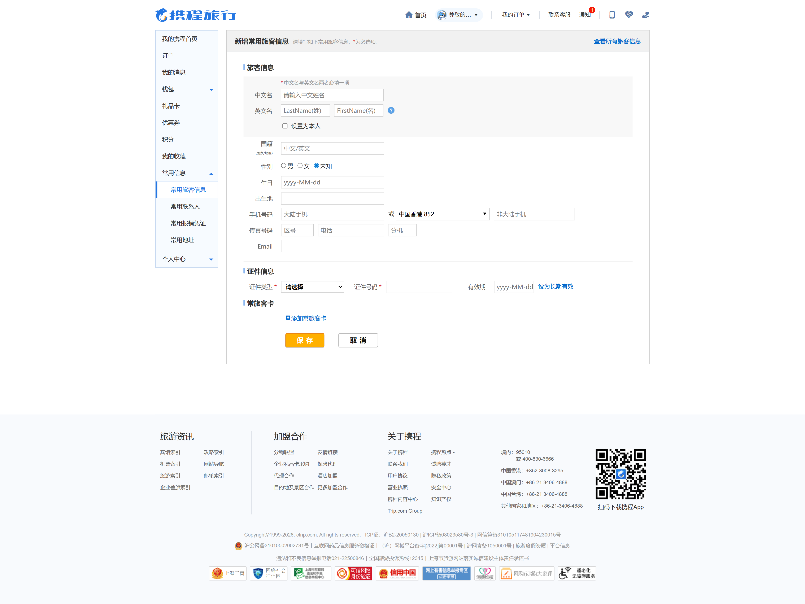

**Dependencies:** None

##### REQ-5.3.2.1 Create a New Traveler
Create a New Traveler

**Dependencies:** REQ-5.3.1.1

**Scenarios:**
- Create a New Traveler
  - **GIVEN:** User is on the frequent traveler list page.
  - **WHEN:** Click “新增” and enter complete identity information
  - **THEN:** Save after validations and required-field checks pass.

##### REQ-5.3.2.2 Exception: Required-Field Validation
Exception Required-Field Validation

**Dependencies:** None

**Scenarios:**
- Exception: Required-Field Validation
  - **GIVEN:** User is on the traveler edit/create modal or page.
  - **WHEN:** Click “保存” without entering a name
  - **THEN:** Show a message: “中文名与英文名两者必填一项”.

#### REQ-5.3.3 Delete Travelers
Provide single-item and batch removal of traveler records.

**Dependencies:** None

##### REQ-5.3.3.1 Delete a Traveler Record
Delete a Traveler Record

**Dependencies:** None

**Scenarios:**
- Delete a Traveler Record
  - **GIVEN:** User is on the frequent traveler list page and can see a traveler row.
  - **WHEN:** Click the “删除” link at the end of a record row
  - **THEN:** A confirmation dialog appears; after confirmation, the record is removed from the database.

##### REQ-5.3.3.2 Batch Delete
Batch Delete

**Dependencies:** None

**Scenarios:**
- Batch Delete
  - **GIVEN:** User is on the frequent traveler list page.
  - **WHEN:** Select multiple travelers
  - **GIVEN:** At least one traveler is selected.
  - **WHEN:** Click the "×删除" button at the bottom
  - **THEN:** Batch delete the selected travelers.

### REQ-5.4 Frequent Address Management
Manage delivery addresses for mailing itineraries or invoices.

**Dependencies:** None

#### REQ-5.4.1 Address List Display
Show recipient name, region, and detailed address information. 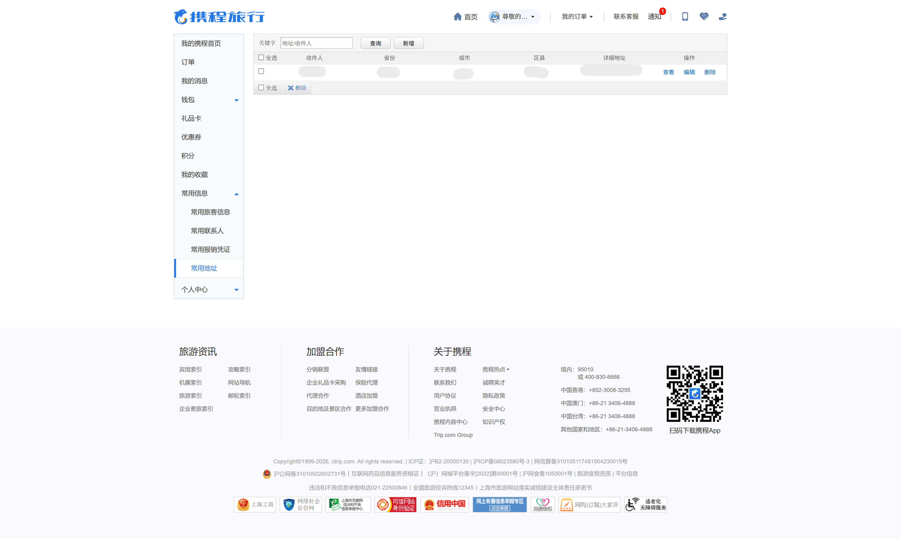

**Dependencies:** None

##### REQ-5.4.1.1 View Address List
View Address List

**Dependencies:** None

**Scenarios:**
- View Address List

#### REQ-5.4.2 Add and Edit Addresses
Capture recipient name, province/city/district (linked selection), detailed address, and mobile number. Reference: 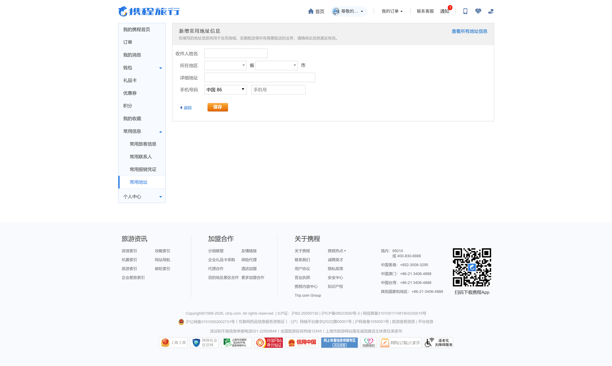

**Dependencies:** None

##### REQ-5.4.2.1 Save a New Address
Save a New Address

**Dependencies:** None

**Scenarios:**
- Save a New Address
  - **GIVEN:** User is on the address create/edit page or modal.
  - **WHEN:** Fill in recipient information and save
  - **THEN:** The new address is added to the list.

#### REQ-5.4.3 Delete Addresses
Remove delivery addresses that are no longer used.

**Dependencies:** None

##### REQ-5.4.3.1 Delete a Single Address
Delete a Single Address

**Dependencies:** None

**Scenarios:**
- Delete a Single Address
  - **GIVEN:** User is on the address list page and can see an address card.
  - **WHEN:** Click the “删除” button next to an address card
  - **THEN:** A confirmation dialog appears; after confirmation, the address is removed.

##### REQ-5.4.3.2 Batch Delete Addresses
Batch Delete Addresses

**Dependencies:** None

**Scenarios:**
- Batch Delete Addresses
  - **GIVEN:** User is on the address list page.
  - **WHEN:** Select the checkboxes in front of multiple addresses
  - **GIVEN:** At least one address is selected.
  - **WHEN:** Click “批量删除”
  - **THEN:** A confirmation dialog appears; after confirmation, all selected addresses are removed.

#### REQ-5.4.4 Address Details Page
Click an address in the address list page to open the address details page. 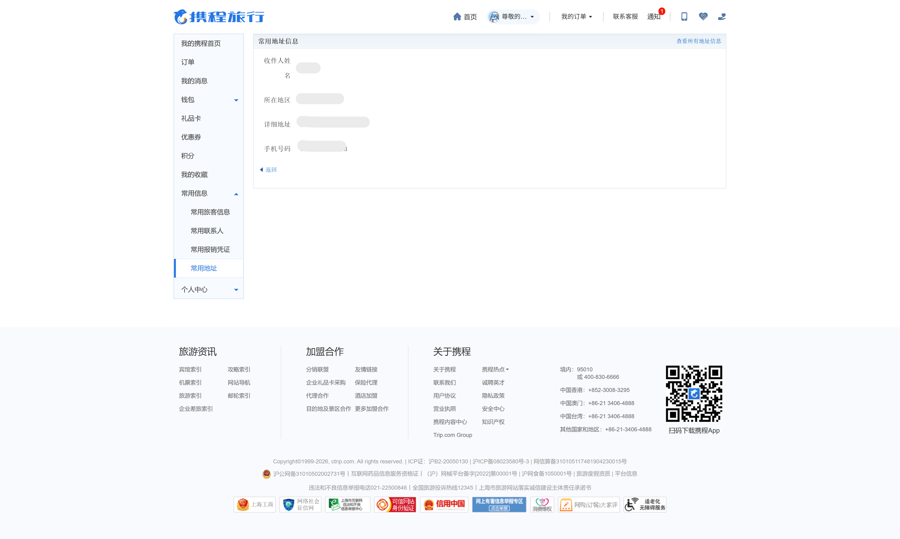

**Dependencies:** None

### REQ-5.5 Frequent Contact Management
Manage contact information used to receive order notifications.

**Dependencies:** None

#### REQ-5.5.1 Contact List and Search
Show contact name, mobile number, and email. Support selecting items for batch operations and searching by name.
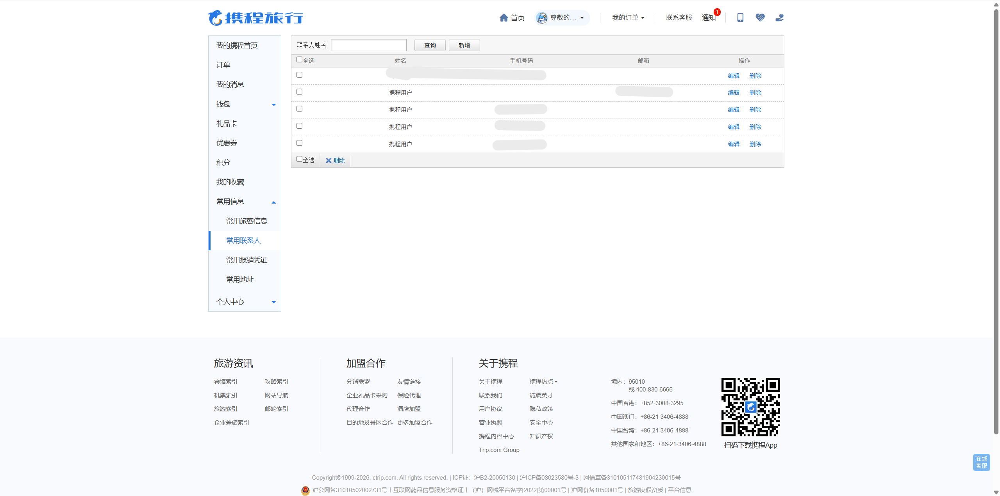

**Dependencies:** None

##### REQ-5.5.1.1 Search Contacts
Search Contacts

**Dependencies:** None

**Scenarios:**
- Search Contacts
  - **GIVEN:** User is on the contact list page.
  - **WHEN:** Enter a contact name and click query
  - **THEN:** The list shows matching results.

##### REQ-5.5.1.2 Batch Delete
Batch Delete

**Dependencies:** None

**Scenarios:**
- Batch Delete
  - **GIVEN:** User is on the contact list page.
  - **WHEN:** Select multiple contacts and click “删除”
  - **THEN:** Remove the selected contacts in batch.

#### REQ-5.5.2 Add and Edit Contacts
Enter real name, mobile number (supports international dialing codes), and email, and allow setting as the default contact. 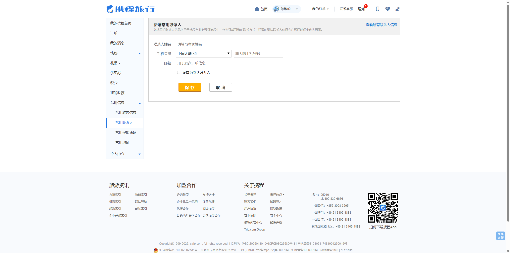

**Dependencies:** None

##### REQ-5.5.2.1 Add a Default Contact
Add a Default Contact

**Dependencies:** None

**Scenarios:**
- Add a Default Contact
  - **GIVEN:** User is on the contact create/edit page or modal.
  - **WHEN:** Fill in the information and check “设置为默认联系人”
  - **THEN:** After saving, the contact has a default indicator.

#### REQ-5.5.3 Delete Contacts
Remove contact records.

**Dependencies:** None

##### REQ-5.5.3.1 Delete a Single Contact
Delete a Single Contact

**Dependencies:** None

**Scenarios:**
- Delete a Single Contact
  - **GIVEN:** User is on the contact list page and can see a contact item.
  - **WHEN:** Click the “删除” button after a contact item
  - **THEN:** Remove it after confirmation.

##### REQ-5.5.3.2 Batch Delete Contacts
Batch Delete Contacts

**Dependencies:** None

**Scenarios:**
- Batch Delete Contacts
  - **GIVEN:** User is on the contact list page.
  - **WHEN:** Select multiple contacts in the list
  - **GIVEN:** At least one contact is selected.
  - **WHEN:** Click “批量删除”
  - **THEN:** After confirmation, remove all selected items.

### REQ-5.6 Frequent Reimbursement Receipt Management
Manage invoice title information, supporting company, government/public institution, and personal titles.

**Dependencies:** None

#### REQ-5.6.1 Receipt List and Search
Show invoice title names, supporting keyword search and batch deletion. 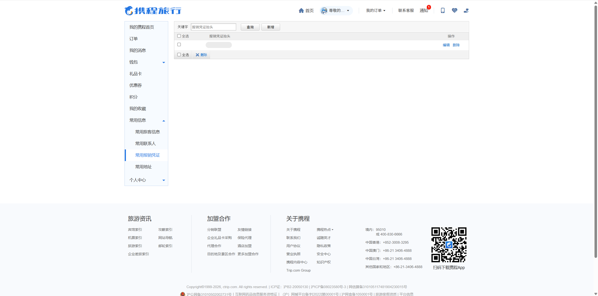

**Dependencies:** None

##### REQ-5.6.1.1 Search Invoice Titles
Search Invoice Titles

**Dependencies:** None

**Scenarios:**
- Search Invoice Titles
  - **GIVEN:** User is on the reimbursement receipt list page.
  - **WHEN:** Enter invoice title keywords to search

#### REQ-5.6.2 Add and Edit Receipts
Fill in invoice title name and tax ID (required for companies), and optionally configure VAT special invoice information. 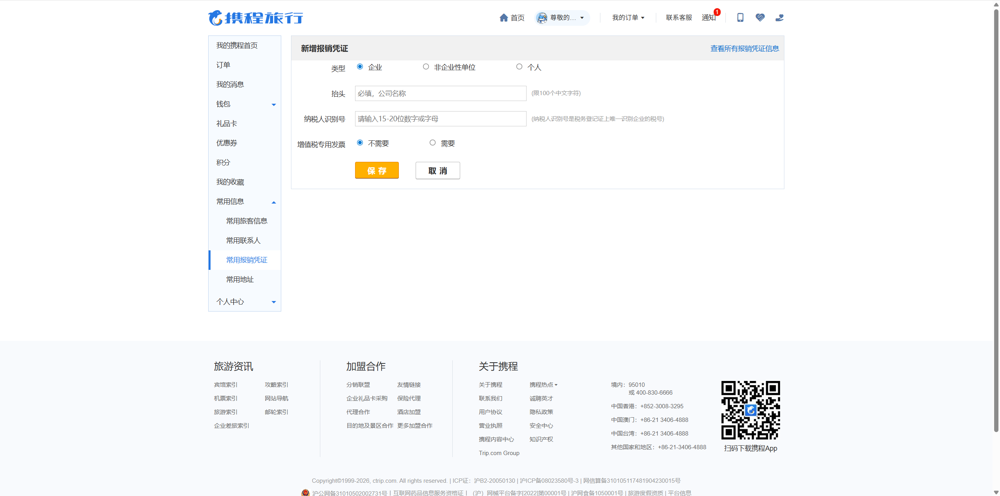

**Dependencies:** None

##### REQ-5.6.2.1 Add a Company Invoice Title
Add a Company Invoice Title

**Dependencies:** None

**Scenarios:**
- Add a Company Invoice Title
  - **GIVEN:** User is on the receipt create/edit page or modal.
  - **WHEN:** Select “企业”, and enter the name and taxpayer identification number
  - **THEN:** Validate the tax ID format.

##### REQ-5.6.2.2 Configure Special VAT Invoice
Configure Special VAT Invoice

**Dependencies:** None

**Scenarios:**
- Configure Special VAT Invoice
  - **GIVEN:** User is on the receipt create/edit page or modal.
  - **WHEN:** Set “增值税专用发票” to “需要”
  - **THEN:** Expand input fields for registered address, phone number, and bank account details.

#### REQ-5.6.3 Delete Receipts
Remove invoice titles that are no longer used.

**Dependencies:** None

##### REQ-5.6.3.1 Delete a Single Receipt
Delete a Single Receipt

**Dependencies:** None

**Scenarios:**
- Delete a Single Receipt
  - **GIVEN:** User is on the reimbursement receipt list page and can see a receipt item.
  - **WHEN:** Click the “删除” button after a receipt item
  - **THEN:** Remove it after confirmation.

##### REQ-5.6.3.2 Batch Delete Receipts
Batch Delete Receipts

**Dependencies:** None

**Scenarios:**
- Batch Delete Receipts
  - **GIVEN:** User is on the reimbursement receipt list page.
  - **WHEN:** Select multiple invoice titles in the list
  - **GIVEN:** At least one invoice title is selected.
  - **WHEN:** Click “批量删除”
  - **THEN:** After confirmation, remove all selected items.

## REQ-6 Personal Center and Account Security
Provide user profile management, avatar settings, and multi-dimensional account security strengthening.

**Dependencies:** REQ-2

### REQ-6.1 Profile Information Display
Centrally display the user’s bound mobile number, email, nickname, name, gender, and date of birth. Reference: 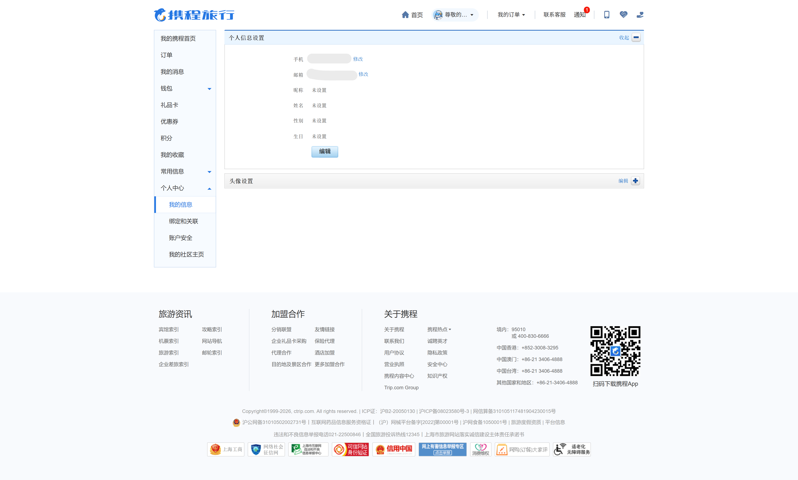

**Dependencies:** None

#### REQ-6.1.1 View Basic Profile Information
View Basic Profile Information

**Dependencies:** REQ-2.4.1

**Scenarios:**
- View Basic Profile Information
  - **GIVEN:** User is in the personal center and can see the sidebar.
  - **WHEN:** Click “我的信息”
  - **THEN:** The right area lists all profile fields the user has set; mobile number and email should be masked.

### REQ-6.2 Edit Profile
Allow users to update nickname, real name, gender, and date of birth. Reference: 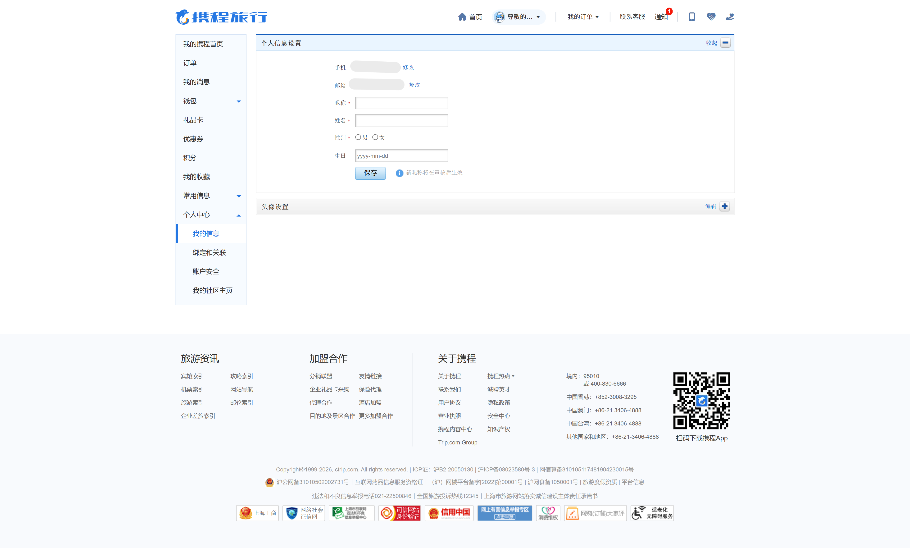

**Dependencies:** REQ-6.1

#### REQ-6.2.1 Update Profile and Save
Update Profile and Save

**Dependencies:** REQ-6.1.1

**Scenarios:**
- Update Profile and Save
  - **GIVEN:** User is on the “我的信息” page.
  - **WHEN:** Click “编辑”
  - **THEN:** Profile fields become editable or the page navigates to an edit page.
  - **GIVEN:** Profile fields are editable.
  - **WHEN:** Enter a new nickname and real name
  - **WHEN:** Select gender (male/female) and date of birth
  - **GIVEN:** Profile updates have been entered.
  - **WHEN:** Click “保存”
  - **THEN:** Show a success message and apply the updated information across the platform.

### REQ-6.3 Account Security Center Home
Overview the account security status, including entry points for login password, bound phone, and bound email settings. Reference: 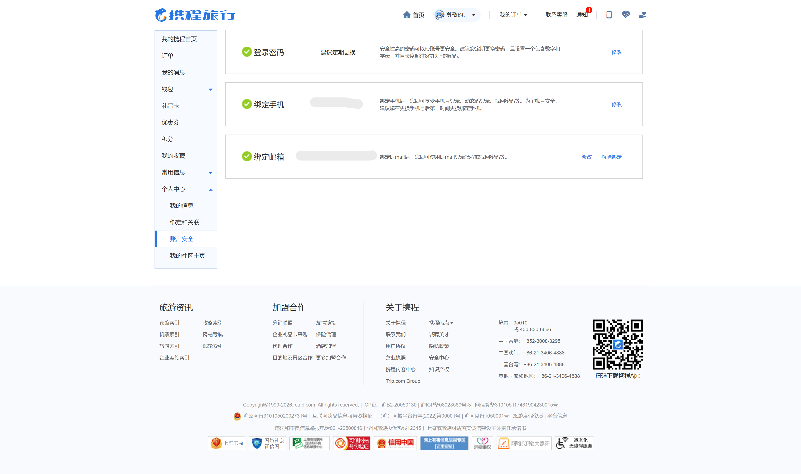

**Dependencies:** None

#### REQ-6.3.1 Enter Security Center
Enter Security Center

**Dependencies:** REQ-2.4.1

**Scenarios:**
- Enter Security Center
  - **GIVEN:** User is in the personal center and can see the sidebar.
  - **WHEN:** Click “账户安全”
  - **THEN:** The list shows security indicators and risk warnings such as “建议定期更换”.

### REQ-6.4 Change Login Password
Users set a new login password by verifying the current password. Reference: 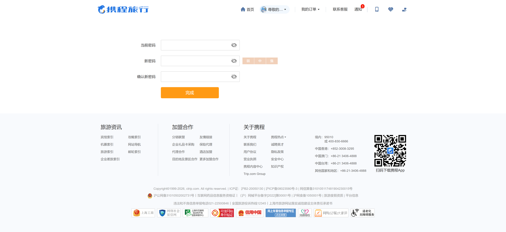

**Dependencies:** REQ-6.3

#### REQ-6.4.1 Standard Password Change Flow
Standard Password Change Flow

**Dependencies:** REQ-6.3.1

**Scenarios:**
- Standard Password Change Flow
  - **GIVEN:** User is in the security center.
  - **WHEN:** Click “修改” next to the login password
  - **THEN:** Enter the change password page.
  - **GIVEN:** User is on the change password page.
  - **WHEN:** Enter the current password, new password, and confirm the new password
  - **THEN:** The password strength meter updates in real time (weak/medium/strong).
  - **GIVEN:** Password inputs are filled in.
  - **WHEN:** Click “完成”
  - **THEN:** After validation passes, the password is updated successfully and re-login is required.

### REQ-6.5 Change Bound Phone Number
Use a two-step verification flow to update the phone number bound to the account. Reference: 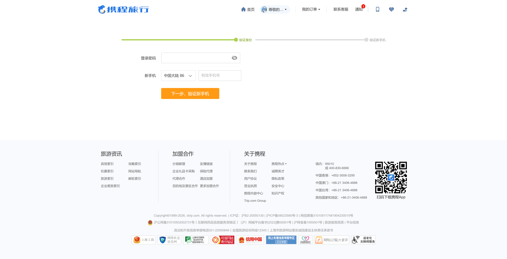

**Dependencies:** REQ-6.3

#### REQ-6.5.1 Verify Identity and Bind New Phone
Verify Identity and Bind New Phone

**Dependencies:** REQ-6.3.1

**Scenarios:**
- Verify Identity and Bind New Phone
  - **GIVEN:** User is in the security center.
  - **WHEN:** Click “修改” next to the bound phone
  - **THEN:** Enter the “验证身份” step.
  - **GIVEN:** User is on the phone change flow and can see the identity verification step.
  - **WHEN:** Enter the login password and the new phone number
  - **GIVEN:** Login password and new phone number have been entered.
  - **WHEN:** Click “下一步，验证新手机”
  - **THEN:** The progress bar updates and a verification code is sent to the new phone.

### REQ-6.6 Change Bound Email
Verify identity by sending a verification code to the currently bound email, then change to a new email. Reference: 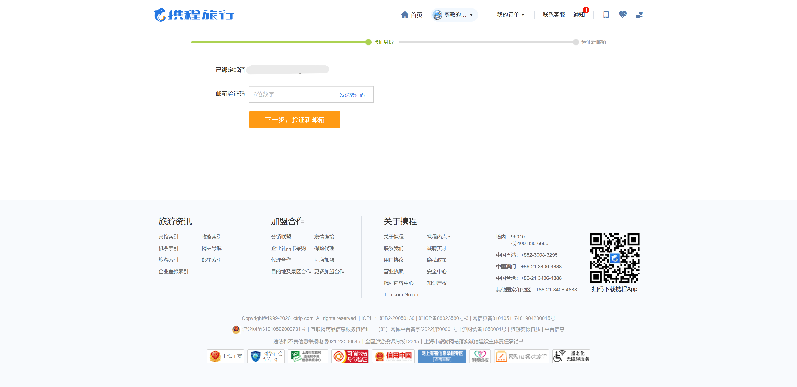

**Dependencies:** REQ-6.3

#### REQ-6.6.1 Email Verification Flow
Email Verification Flow

**Dependencies:** REQ-6.3.1

**Scenarios:**
- Email Verification Flow
  - **GIVEN:** User is in the security center.
  - **WHEN:** Click “修改” next to the bound email
  - **THEN:** Show the masked currently bound email address.
  - **GIVEN:** User is on the email verification step and can see the verification code input.
  - **WHEN:** Click “发送验证码” and enter the 6-digit code
  - **GIVEN:** A 6-digit verification code has been entered.
  - **WHEN:** Click “下一步，验证新邮箱”
  - **THEN:** Enter the new email entry step.

## REQ-7 Flight Status
Provide real-time flight status query services, supporting searches by flight number or by route (origin/destination).

**Dependencies:** REQ-1

### REQ-7.1 Enter Flight Status Page
Enter Flight Status Page

**Dependencies:** None

**Scenarios:**
- Enter Flight Status Page
  - **GIVEN:** User is on the homepage.
  - **WHEN:** Click Homepage -> Flights -> “航班动态”
  - **THEN:** Enter the flight status query page.

### REQ-7.2 Search Criteria Configuration
Include switching between flight-number search and route search, and entering parameters.

**Dependencies:** None

#### REQ-7.2.1 Search by Flight Number
Users enter a specific flight number (e.g., MU1234) and departure date for an exact query. 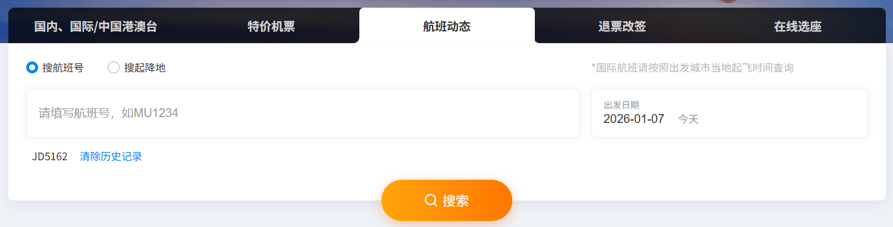

**Dependencies:** None

##### REQ-7.2.1.1 Exact Flight Number Query
Exact Flight Number Query

**Dependencies:** None

**Scenarios:**
- Exact Flight Number Query
  - **GIVEN:** User is on the flight status query page.
  - **WHEN:** Select the “搜航班号” radio button
  - **THEN:** Show the flight number input and date picker.
  - **WHEN:** Enter “JD5162” and click search
  - **THEN:** Navigate to the details page for this flight.

#### REQ-7.2.2 Search by Route (Origin/Destination)
Similar to flight booking search: enter origin city, destination city, and date for a range query. 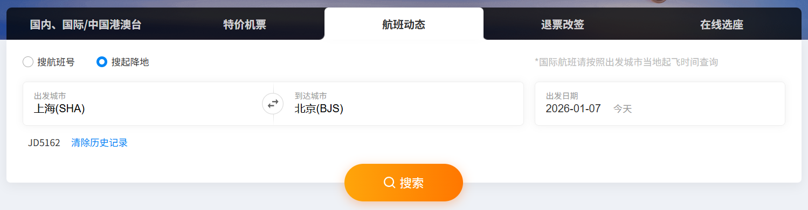

**Dependencies:** None

##### REQ-7.2.2.1 Route Range Query
Route Range Query

**Dependencies:** None

**Scenarios:**
- Route Range Query
  - **GIVEN:** User is on the flight status query page.
  - **WHEN:** Select the “搜起降地” radio button
  - **THEN:** Show origin/destination city inputs and a date picker.
  - **WHEN:** Enter “上海” to “北京” and click search
  - **THEN:** Navigate to the flight list page, showing all relevant flights for the day.

##### REQ-7.2.2.2 Swap Origin and Destination
Swap Origin and Destination

**Dependencies:** REQ-7.2.2.1

**Scenarios:**
- Swap Origin and Destination
  - **GIVEN:** User is on the flight status query page and the route inputs are visible.
  - **WHEN:** Click the “双向箭头” swap icon in the middle
  - **THEN:** Origin and destination values are swapped.

#### REQ-7.2.3 Search History
Automatically record query history, supporting one-click reuse or clearing.

**Dependencies:** None

##### REQ-7.2.3.1 Use History
Use History

**Dependencies:** None

**Scenarios:**
- Use History
  - **GIVEN:** User is on the flight status query page and history items are visible.
  - **WHEN:** Click a history item below the input (e.g., “JD5162”)
  - **THEN:** Auto-fill the search criteria and run the query.

##### REQ-7.2.3.2 Clear History
Clear History

**Dependencies:** None

**Scenarios:**
- Clear History
  - **GIVEN:** User is on the flight status query page and history items are visible.
  - **WHEN:** Click the “清除历史记录” link
  - **THEN:** The history area is cleared.

### REQ-7.3 Results Display
Display a single flight details view or a flight list, depending on the search dimension.

**Dependencies:** REQ-7.2

#### REQ-7.3.1 Flight List Page (Route Result)
Show all flights for a specific route on the selected day and their statuses. Reference: 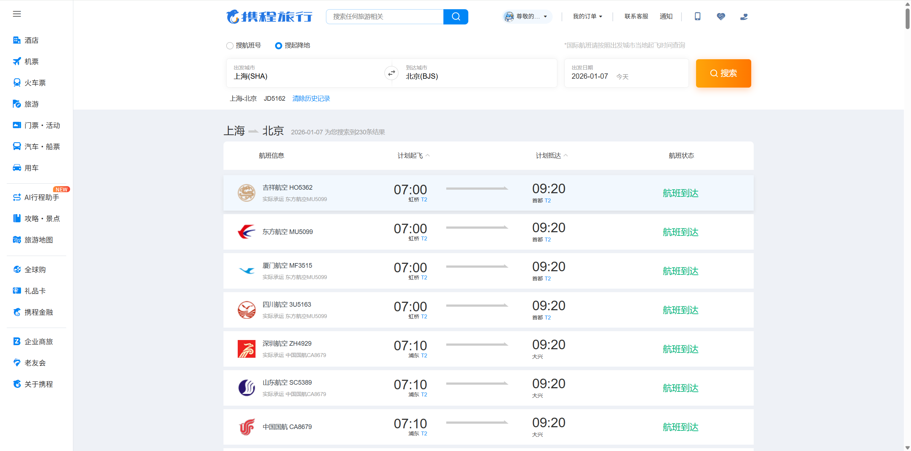

**Dependencies:** None

##### REQ-7.3.1.1 View Flight Status in List
View Flight Status in List

**Dependencies:** REQ-7.2.2.1

**Scenarios:**
- View Flight Status in List
  - **GIVEN:** User is on the flight status list page.
  - **WHEN:** Browse list items
  - **THEN:** Show airline, flight number, departure/arrival times, and real-time status (e.g., “航班到达”, “计划起飞”).

#### REQ-7.3.2 Flight Details Page (Flight Detail)
Show full dynamic information for a specific flight, including check-in counters, gate, baggage carousel, and other ground service details. Reference: 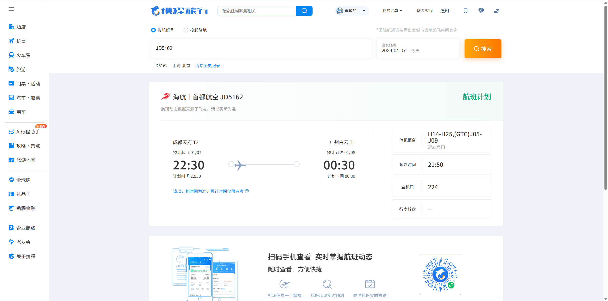

**Dependencies:** None

##### REQ-7.3.2.1 View Detailed Status
View Detailed Status

**Dependencies:** None

**Scenarios:**
- View Detailed Status
  - **GIVEN:** User has navigated to a flight details page.
  - **WHEN:** View the flight details page
  - **THEN:** The top shows origin/destination cities, time, and a progress bar; the right info panel shows check-in counters (e.g., H14-H25), check-in deadline, gate, and baggage carousel number.

## REQ-8 Reimbursement Voucher Management
Provide self-service issuance of reimbursement vouchers such as itineraries and invoices, progress tracking, and history management.

**Dependencies:** REQ-4

### REQ-8.1 Voucher Entry and Home
Aggregate voucher operations into a unified service hub. Enter via the top navigation “更多服务” -> “报销凭证”. Reference: 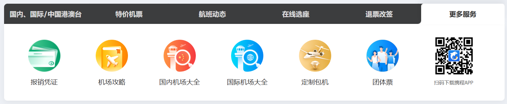

**Dependencies:** None

#### REQ-8.1.1 Status Category Navigation
On the home page, use tabs to separate voucher lifecycle states: “待开凭证”, “进行中”, and “已完成”. 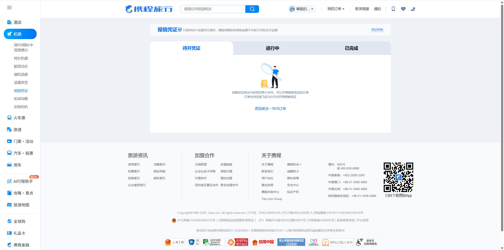

**Dependencies:** None

##### REQ-8.1.1.1 Switch to Completed
Switch to Completed

**Dependencies:** None

**Scenarios:**
- Switch to Completed
  - **GIVEN:** User is on the reimbursement voucher home page and can see the status tabs.
  - **WHEN:** Click the “已完成” tab
  - **THEN:** The list refreshes to show historical issued voucher records.

#### REQ-8.1.2 Rule Tips and Guidance
The top notice bar shows issuance rules (e.g., “订单支持支付后365天内开具”).

**Dependencies:** None

### REQ-8.2 Pending Voucher Management
Show valid orders under the current account that can apply for reimbursement vouchers.

**Dependencies:** None

#### REQ-8.2.1 View Eligible Orders
View Eligible Orders

**Dependencies:** None

**Scenarios:**
- View Eligible Orders
  - **GIVEN:** User is on the reimbursement voucher home page.
  - **WHEN:** Enter the “待开凭证” tab
  - **THEN:** If there are no orders, show an empty state illustration and the text “您暂无报销凭证可开具”; if there are orders, show them in a list.

#### REQ-8.2.2 Find More Historical Orders
Find More Historical Orders

**Dependencies:** None

**Scenarios:**
- Find More Historical Orders
  - **GIVEN:** User is on the reimbursement voucher home page and can see the eligible orders list.
  - **WHEN:** Click the “查看更多一年内订单” link
  - **THEN:** Load and display all orders within one year that support supplementary voucher issuance.

### REQ-8.3 Voucher Application and Progress
(Reserved) Define the specific application flow for invoices and itineraries and logistics tracking.

**Dependencies:** REQ-8.2

#### REQ-8.3.1 In-Progress Vouchers
Show progress for vouchers that have been applied for but are not yet shipped or are being shipped.

**Dependencies:** None

#### REQ-8.3.2 Completed Vouchers
Show download entry points for successfully issued e-invoices or delivery receipt records for paper itineraries.

**Dependencies:** None

## REQ-9 Airport Guide
Provide detailed information for airports worldwide, including weather, transportation, facilities, and contact numbers. 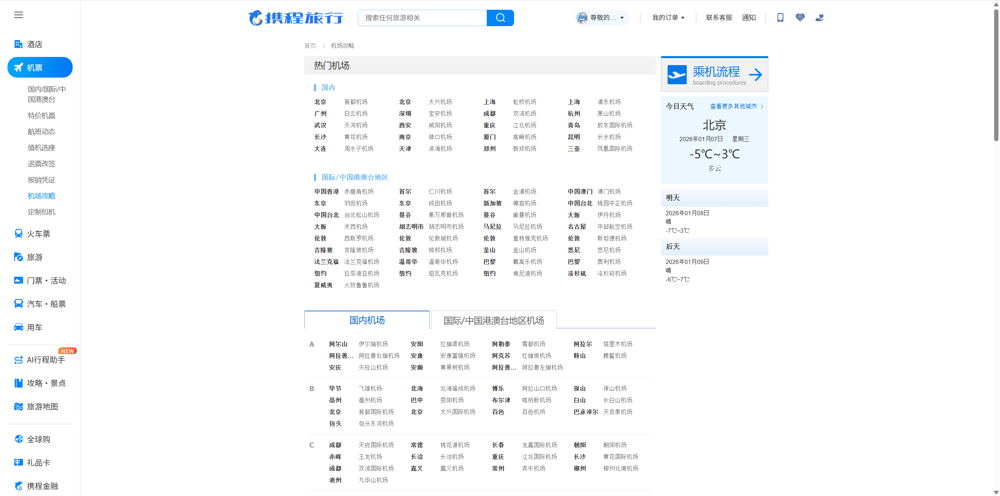

**Dependencies:** REQ-1

### REQ-9.1 Enter Airport Guide
Enter Airport Guide

**Dependencies:** None

**Scenarios:**
- Enter Airport Guide
  - **GIVEN:** User is on the homepage.
  - **WHEN:** Click Homepage -> Flights -> “更多服务” -> “机场攻略”
  - **THEN:** The main page area switches to the airport guide home.

### REQ-9.2 Airport List and Overview
The airport information home page, providing airport indexes by region and a weather overview.

**Dependencies:** None

#### REQ-9.2.1 Popular Airports and Category Index
Display airports in three sections: “热门机场”, “国内”, and “国际/中国港澳台地区”.

**Dependencies:** None

##### REQ-9.2.1.1 Browse Popular Airports
Browse Popular Airports

**Dependencies:** None

**Scenarios:**
- Browse Popular Airports
  - **GIVEN:** User is on the airport guide home page.
  - **WHEN:** View the “热门机场” section
  - **THEN:** Show quick entries for major hub airports such as Beijing Capital, Shanghai Pudong, and Guangzhou Baiyun.

##### REQ-9.2.1.2 Find via Alphabet Index
Find via Alphabet Index

**Dependencies:** None

**Scenarios:**
- Find via Alphabet Index
  - **GIVEN:** User is on the airport guide home page.
  - **WHEN:** In the “国内机场” section, click the letter “C”
  - **THEN:** Quickly jump to the list of city airports starting with C, such as Chengdu, Chongqing, and Changchun.

#### REQ-9.2.2 Destination Weather Card
The floating card on the right shows real-time weather and forecast for the current location or the selected city.

**Dependencies:** None

##### REQ-9.2.2.1 View Travel Weather
View Travel Weather

**Dependencies:** None

**Scenarios:**
- View Travel Weather
  - **GIVEN:** User is on the airport guide home page and can see the weather card.
  - **WHEN:** Review the “今日天气” card on the right
  - **THEN:** Show today’s temperature for Beijing (or another selected city), e.g., -5°C to 3°C, and an entry point for “乘机流程”.

### REQ-9.3 Airport Detail Services
A deep information page for a specific airport, containing four core sub-sections.
Default to the airport overview. 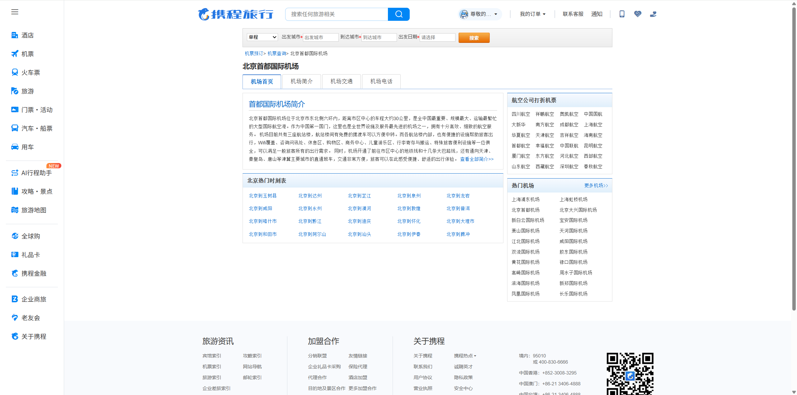

**Dependencies:** REQ-9.2

#### REQ-9.3.1 Airport Overview
Display an airport overview.
Airport overview 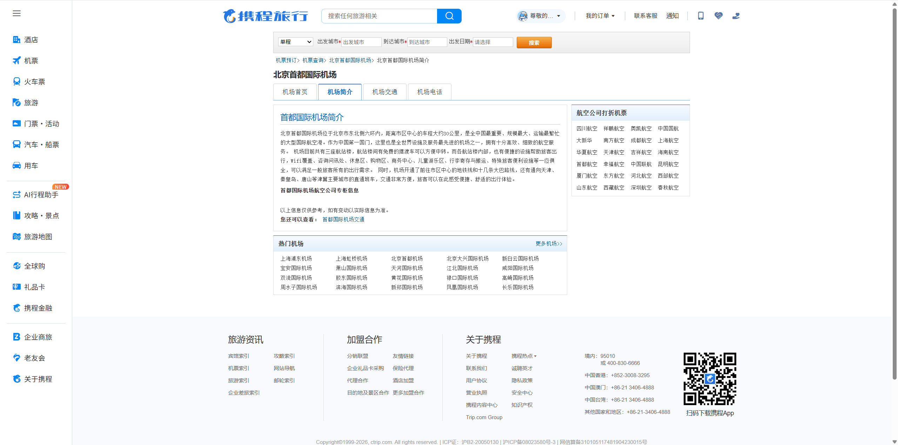

**Dependencies:** None

##### REQ-9.3.1.1 View Airport Overview
View Airport Overview

**Dependencies:** None

**Scenarios:**
- View Airport Overview
  - **GIVEN:** User is on an airport detail page.
  - **WHEN:** Click the “机场简介” tab
  - **THEN:** Show detailed text introduction about Capital Airport, such as its location, number of runways, and “中国第一国门”.

#### REQ-9.3.2 Airport Transportation Guide
List transportation options to/from the airport in detail, including buses, metro/express rail, airport shuttle buses, and taxis. 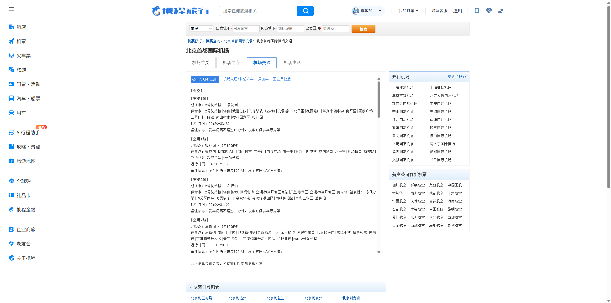

**Dependencies:** None

##### REQ-9.3.2.1 Check Shuttle Bus Timetable
Check Shuttle Bus Timetable

**Dependencies:** None

**Scenarios:**
- Check Shuttle Bus Timetable
  - **GIVEN:** User is on an airport detail page.
  - **WHEN:** Click the “机场交通” tab and view the “市内巴士” section
  - **THEN:** Show each route’s stops, first/last departure times, and headway (e.g., Fangzhuang line, Xidan line).

#### REQ-9.3.3 Airport Service Phone Numbers
Collect common service hotlines such as information desk, lost and found, first aid center, and baggage storage. 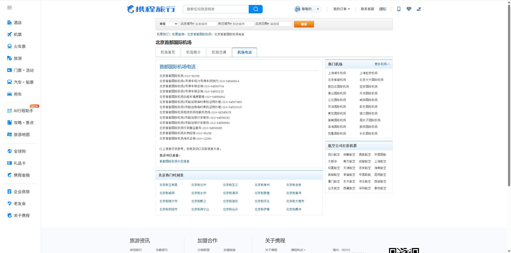

**Dependencies:** None

##### REQ-9.3.3.1 Find First Aid Phone Number
Find First Aid Phone Number

**Dependencies:** None

**Scenarios:**
- Find First Aid Phone Number
  - **GIVEN:** User is on an airport detail page.
  - **WHEN:** Click the “机场电话” tab
  - **THEN:** The list shows the medical first aid center phone number (e.g., 010-6454xxxx).

## REQ-10 Airport Directory
A quick navigation entry in “更多服务”, containing complete indexes of domestic and international airports. Clicking it navigates to the Airport Guide home.

**Dependencies:** REQ-9

### REQ-10.1 Domestic Airport Directory
Provide quick entry points for all domestic civil airports.

**Dependencies:** None

#### REQ-10.1.1 Enter Domestic Airport Directory
Enter Domestic Airport Directory

**Dependencies:** None

**Scenarios:**
- Enter Domestic Airport Directory
  - **GIVEN:** User is in the “更多服务” menu.
  - **WHEN:** Click “国内机场大全”
  - **THEN:** Navigate to the Airport Guide home (REQ-9) and automatically focus on the “国内机场” category tab.

### REQ-10.2 International Airport Directory
Provide quick entry points for major international airports worldwide and airports in Hong Kong, Macau, and Taiwan.

**Dependencies:** None

#### REQ-10.2.1 Enter International Airport Directory
Enter International Airport Directory

**Dependencies:** None

**Scenarios:**
- Enter International Airport Directory
  - **GIVEN:** User is in the “更多服务” menu.
  - **WHEN:** Click “国际机场大全”
  - **THEN:** Navigate to the Airport Guide home (REQ-9) and automatically focus on the “国际/中国港澳台地区” category tab.
