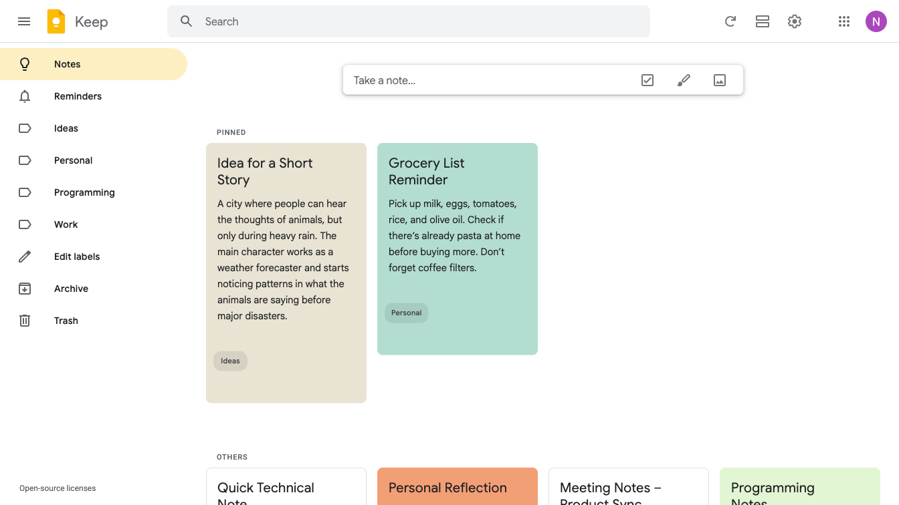
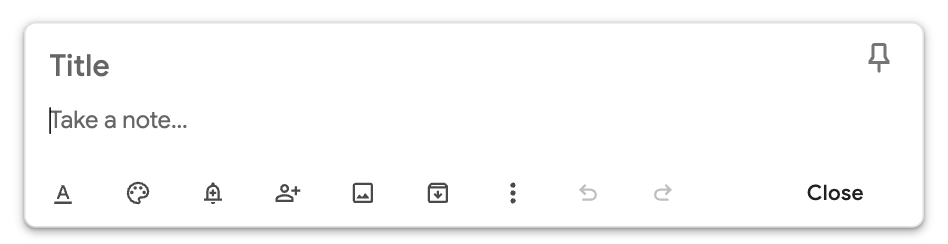
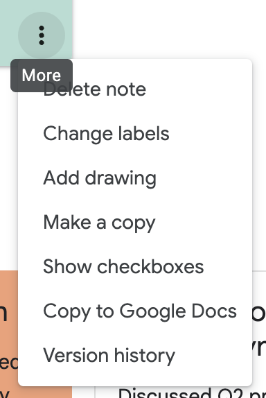
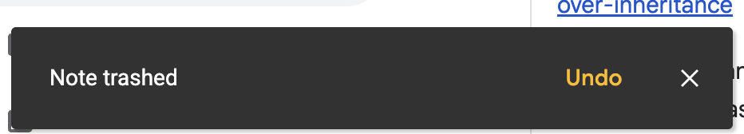
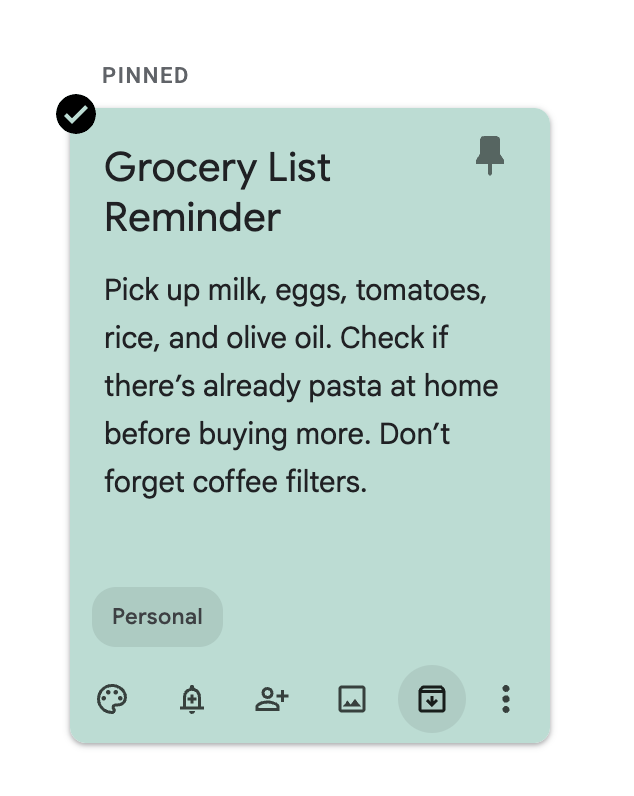
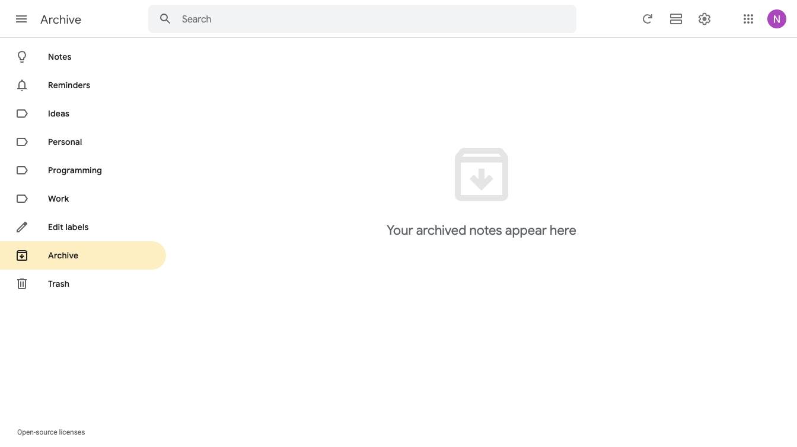
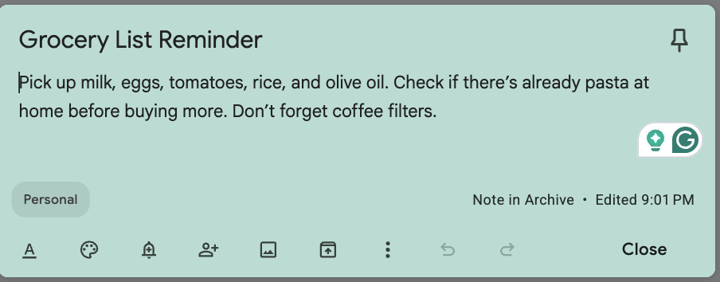

# Keep (REQ-2 slice)
Notes Management slice of the Keep note app: the REQ-2 subtree of the full keep fixture, extracted as an independently compilable requirement set. Node ids, dependency edges, and requirement text are verbatim from the parent tree.

## REQ-2 Notes Management
Core note management capability for listing, creating, updating, deleting, archiving, coloring, labeling, and pinning notes. Reference image: 

**Dependencies:** REQ-1

### REQ-2.1 Note Listing
Display the notes list on the home page with pinned notes shown separately from unpinned notes.

**Dependencies:** REQ-1.1

**Scenarios:**
- Note Listing
  - **GIVEN:** User has opened the application and the system is accessible.
  - **WHEN:** View the home page.
  - **THEN:** The page displays the available notes list, with pinned notes separated from regular notes.

### REQ-2.2 Create Note
Create a note from the Take a note form, expand the editor for title and content, and autosave the note when the editor is closed. Take a note form from homepage image:  Note form image: 

**Dependencies:** REQ-2.1

**Scenarios:**
- Create Note
  - **GIVEN:** User is on the home page.
  - **WHEN:** Click the "Take a note" form, enter a title and content, and close the editor.
  - **THEN:** The note is autosaved, the editor closes, and the note appears in the notes list.

### REQ-2.3 Delete Note
Delete notes from the note actions menu and manage the deleted-note recovery flow.

**Dependencies:** REQ-2.2

#### REQ-2.3.1 Delete
Delete a note from the note actions menu without an extra confirmation dialog. Dropdown image: 

**Dependencies:** REQ-2.2

**Scenarios:**
- Delete
  - **GIVEN:** User is on the home page and can see at least one note.
  - **WHEN:** Hover over a note, open More options, and choose "Delete Note".
  - **THEN:** The note is removed from the main notes list and a delete notification is shown.

#### REQ-2.3.2 Notification and Undo
Show a delete notification with an Undo action after a note is deleted, allow recovery through Undo, and allow the notification to dismiss automatically or be closed manually. Reference image for notification: 

**Dependencies:** REQ-2.3.1

**Scenarios:**
- Notification and Undo
  - **GIVEN:** User has just deleted a note from the home page.
  - **WHEN:** Click the Undo button in the visible delete notification.
  - **THEN:** The note is restored and the page shows an "Action undone" notification.

#### REQ-2.3.3 Trash list
Open the Trash view from the sidebar and display deleted notes, with support for emptying trash and automatic deletion after seven days. Reference image: 

**Dependencies:** REQ-2.3.1

**Scenarios:**
- Trash list
  - **GIVEN:** User can see the sidebar.
  - **WHEN:** Click the Trash item in the sidebar.
  - **THEN:** The page displays the list of deleted notes.

### REQ-2.4 Update Note
Edit the content of an existing note and persist the updated note after the editor is closed. Reference image: 

**Dependencies:** REQ-2.2

**Scenarios:**
- Update Note
  - **GIVEN:** User is on the home page and can see a note.
  - **WHEN:** Open the note, edit its content, and close the note editor.
  - **THEN:** The note editor closes and the updated content is saved.

### REQ-2.5 Archive Note
Archive and unarchive notes, and show the archived notes list separately from active notes.

**Dependencies:** REQ-2.2

#### REQ-2.5.1 Archive
Archive a note from the note actions area and show an Undo notification. Reference image: 

**Dependencies:** REQ-2.2

**Scenarios:**
- Archive
  - **GIVEN:** User is on the home page and can see a note.
  - **WHEN:** Click the archive button on the note.
  - **THEN:** The note moves to the archive list and the page shows a notification with an Undo action.

#### REQ-2.5.2 Archive Undo
Restore an archived note by using the Undo action from the archive notification.

**Dependencies:** REQ-2.5.1

**Scenarios:**
- Archive Undo
  - **GIVEN:** The archive notification is visible after archiving a note.
  - **WHEN:** Click the Undo action in the notification.
  - **THEN:** The note returns to the main notes list.

#### REQ-2.5.3 Show archived notes
Open the Archived view from the sidebar and display all archived notes. Reference image: 

**Dependencies:** REQ-2.5.1

**Scenarios:**
- Show archived notes
  - **GIVEN:** User can see the sidebar.
  - **WHEN:** Click Archived in the sidebar.
  - **THEN:** The page displays the archived notes list.

#### REQ-2.5.4 Unarchive
Restore an archived note from the archived notes list. Reference image: 

**Dependencies:** REQ-2.5.3

**Scenarios:**
- Unarchive
  - **GIVEN:** User is viewing the archived notes list.
  - **WHEN:** Click Unarchive on an archived note.
  - **THEN:** The note is removed from the archived list and returned to the main notes list.

### REQ-2.6 Note Coloring
Allow users to apply different background colors to notes during creation and after a note already exists. Reference image: 

**Dependencies:** REQ-2.2

#### REQ-2.6.1 Change note color
Change the color of an existing note.

**Dependencies:** REQ-2.2

**Scenarios:**
- Change note color
  - **GIVEN:** User is on the home page and can see a note.
  - **WHEN:** Open the color palette for the note and choose the light green color.
  - **THEN:** The note background changes to light green.

#### REQ-2.6.2 Choose note color when created
Set the color of a note during note creation.

**Dependencies:** REQ-2.2

**Scenarios:**
- Choose note color when created
  - **GIVEN:** User has opened the "Take a note" editor.
  - **WHEN:** Open the color palette, choose a color, enter a title and content, and close the editor.
  - **THEN:** The created note is saved with the selected color.

### REQ-2.7 Labels Management
Allow users to assign labels to notes, manage labels, and filter notes by label.

**Dependencies:** REQ-2.2

#### REQ-2.7.1 Assign label to a note
Assign one or more labels to an existing note. Reference image: 

**Dependencies:** REQ-2.2

**Scenarios:**
- Assign label to a note
  - **GIVEN:** User is on the home page and can see a note.
  - **WHEN:** Open More options, choose "Change labels", and select a label.
  - **THEN:** The selected label is assigned to the note and displayed on the note.

#### REQ-2.7.2 Remove label from a note
Remove an assigned label from a note.

**Dependencies:** REQ-2.7.1

**Scenarios:**
- Remove label from a note
  - **GIVEN:** User is on the home page and can see a note that already has a label.
  - **WHEN:** Open More options, choose "Change labels", and clear the selected label.
  - **THEN:** The label is removed from the note.

#### REQ-2.7.3 Default label
Provide "Reminders" as a default label in the label list.

**Dependencies:** None

**Scenarios:**
- Default label
  - **GIVEN:** The system has been initialized.
  - **WHEN:** View the labels list.
  - **THEN:** The labels list includes "Reminders" as a default label with its own icon.

#### REQ-2.7.4 Assign default label when creating note
Assign the default "Reminders" label during note creation.

**Dependencies:** REQ-2.7.3

**Scenarios:**
- Assign default label when creating note
  - **GIVEN:** User is on the home page and the "Take a note" editor is open.
  - **WHEN:** Choose the "Reminders" label, enter a title and content, and close the editor.
  - **THEN:** The created note is saved with the "Reminders" label.

#### REQ-2.7.5 Edit labels
Create, rename, and delete labels from the label management list. Reference image: 

**Dependencies:** REQ-2.7.1

**Scenarios:**
- Edit labels
  - **GIVEN:** User can see the sidebar.
  - **WHEN:** Click "Edit Labels", change a label name, and save the update.
  - **THEN:** The label list reflects the saved changes.

#### REQ-2.7.6 View by labels
Show all labels in the sidebar and allow users to filter the notes list by the selected label. Reference image: 

**Dependencies:** REQ-2.7.1

##### REQ-2.7.6.1 View list filtered by label
Filter the notes list by a selected label.

**Dependencies:** REQ-2.7.1

**Scenarios:**
- View list filtered by label
  - **GIVEN:** User can see the sidebar.
  - **WHEN:** Click a specific label in the sidebar.
  - **THEN:** The notes list shows only notes that have the selected label.

##### REQ-2.7.6.2 View all notes
Return from a label-filtered view to the full notes list.

**Dependencies:** REQ-2.7.6.1

**Scenarios:**
- View all notes
  - **GIVEN:** User can see the sidebar.
  - **WHEN:** Click "Notes" in the sidebar.
  - **THEN:** The notes list shows all notes.

##### REQ-2.7.6.3 View Reminders
Filter the notes list by the default "Reminders" label.

**Dependencies:** REQ-2.7.3

**Scenarios:**
- View Reminders
  - **GIVEN:** User can see the sidebar.
  - **WHEN:** Click "Reminders" in the sidebar.
  - **THEN:** The notes list shows only notes with the "Reminders" label.

### REQ-2.8 Pinned Notes
Allow users to pin frequently used notes to the top of the notes list and unpin them later.

**Dependencies:** REQ-2.2

#### REQ-2.8.1 Pin note
Pin an existing note from the note card. Reference image: 

**Dependencies:** REQ-2.2

**Scenarios:**
- Pin note
  - **GIVEN:** User is on the home page and can see a note.
  - **WHEN:** Click the pin button on the note.
  - **THEN:** The pin state is shown and the note appears in the pinned section at the top of the page.

#### REQ-2.8.2 Unpin note
Remove the pinned state from a pinned note.

**Dependencies:** REQ-2.8.1

**Scenarios:**
- Unpin note
  - **GIVEN:** User is on the home page and the note is pinned.
  - **WHEN:** Click the unpin button on the pinned note.
  - **THEN:** The note is removed from the pinned section and returned to the regular notes list.

#### REQ-2.8.3 Pin note when creating it
Create a note in the pinned state.

**Dependencies:** REQ-2.2

**Scenarios:**
- Pin note when creating it
  - **GIVEN:** User is on the home page and the "Take a note" editor is open.
  - **WHEN:** Enter a title and content, click the pin button, and close the editor.
  - **THEN:** The note is created and displayed in the pinned section.

